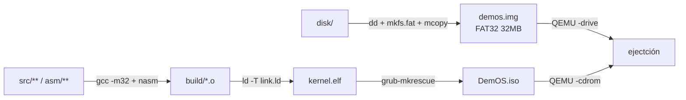

# Build

Cómo se compila y empaqueta DemOS en una ISO booteable y un disco virtual FAT32.

```mermaid
graph LR
    SRC[src/** / asm/**] -->|gcc -m32 + nasm| OBJ[build/*.o]
    OBJ -->|ld -T link.ld| KERNEL[kernel.elf]
    DISKDIR[disk/] -->|dd + mkfs.fat + mcopy| IMG[demos.img<br/>FAT32 32MB]
    KERNEL -->|grub-mkrescue| ISO[DemOS.iso]
    IMG -->|QEMU -drive| RUN[ejectción]
    ISO -->|QEMU -cdrom| RUN
```

## En esta sección

- [Makefile](./makefile/) — sistema de compilación, banderas, ISO y disco
