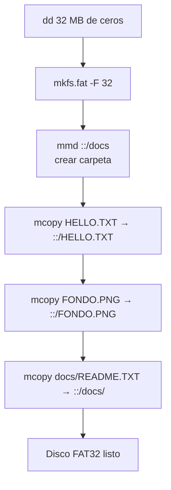

# Sistema de compilación (Makefile)

## Visión general

El `Makefile` automatiza la compilación, el enlazado, la generación de la ISO y del **disco virtual FAT32**, y la ejecución en QEMU.

```makefile
INCDIRS = ./include/
CODEDIRS = src/kernel src/drivers src/fs src/util src/gui

CC = gcc
DEPFLAGS = -MP -MD
NOFLAGS = -nostdlib -nostdinc -fno-builtin -fno-stack-protector -nodefaultlibs -ffreestanding -mno-mmx -mno-sse -mno-sse2 -mno-sse3 -mno-3dnow
CFLAGS = -m32 -Wall -Wextra -Werror -Wno-error=unused-variable -g $(foreach D, $(INCDIRS), -I$(D)) $(DEPFLAGS) $(NOFLAGS)

LDFLAGS = -T link.ld -melf_i386
AS = nasm
ASFLAGS = -f elf32

BUILDDIR = build

# Disco virtual FAT32 que se adjunta a QEMU y cataloga el filesystem.
DEMOS_IMG = demos.img
DISK_MEGS = 32
DISKDIR = disk
```

## Desglose de banderas

### Compilación (`CFLAGS`/`NOFLAGS`)

| Bandera | Explicación |
|---------|-------------|
| `-m32` | Genera código de 32 bits |
| `-Wall -Wextra -Werror` | Activa todos los warnings y los trata como errores |
| `-g` | Incluye información de depuración (debug symbols) |
| `-nostdlib` | No vincula la biblioteca estándar de C |
| `-nostdinc` | No busca cabeceras en directorios del sistema |
| `-fno-builtin` | Desactiva optimizaciones de funciones built-in de GCC |
| `-fno-stack-protector` | Desactiva la protección de pila (stack canary) |
| `-nodefaultlibs` | No vincula bibliotecas por defecto |
| `-ffreestanding` | Modo autónomo (sin SO anfitrión) |
| `-mno-mmx -mno-sse -mno-sse2 -mno-sse3 -mno-3dnow` | Desactiva extensiones SIMD/vectoriales (importante en un kernel de 32 bits) |
| `-MP -MD` | Genera dependencias automáticas (archivos .d) |
| `-Wno-error=unused-variable` | No tratar variables sin usar como error |

### Ensamblador (`ASFLAGS`)

| Bandera | Explicación |
|---------|-------------|
| `-f elf32` | Genera un objeto en formato ELF de 32 bits |

### Enlazador (`LDFLAGS`)

| Bandera | Explicación |
|---------|-------------|
| `-T link.ld` | Usa un script de enlace personalizado |
| `-melf_i386` | Emula el enlazador de i386 (ELF 32 bits) |

## Objetivos (targets)

| Comando | Qué hace |
|---------|----------|
| `make` / `make all` | Compila todo, genera `kernel.elf`, `demos.img` y `DemOS.iso` |
| `make runqemu` | Compila y ejecuta en QEMU (CD + disco IDE) |
| `make cleanrunqemu` | Limpia, recompila y ejecuta |
| `make format` | Formatea código con clang-format |
| `make tidy` | Analiza código con clang-tidy |
| `make cppcheck` | Analiza código con cppcheck |
| `make lint` | Ejecuta format + tidy + cppcheck |
| `make clean` | Elimina `build/`, `iso/`, `DemOS.iso` y `demos.img` |

## Archivos fuente

El Makefile descubre automáticamente los archivos `.c` en los directorios de código:

| Tipo | Archivos | Compilador |
|------|----------|------------|
| C | `src/kernel/*.c`, `src/drivers/*.c`, `src/fs/*.c`, `src/util/*.c`, `src/gui/*.c` | `gcc -m32` |
| C | `src/graphic_context.c` | `gcc -m32` |
| Ensamblador | `asm/loader.s` | `nasm -f elf32` |
| Ensamblador | `asm/interruptstubs.s` | `gcc -m32` (ensamblador GNU) |

> **Nota**: `asm/interruptstubs.s` se compila con `gcc` en lugar de `nasm` porque usa la sintaxis GNU (GAS) con macros `.macro`, no sintaxis NASM.

## Generación del kernel (`kernel.elf`)

```makefile
$(BUILDDIR)/kernel.elf: $(OBJECTS)
	ld $(LDFLAGS) $(OBJECTS) -o $@
```

Los archivos `.c` se compilan a objetos en `build/` y se enlazan con `link.ld`.

## Disco virtual FAT32 (`demos.img`)

```makefile
$(DEMOS_IMG): $(wildcard $(DISKDIR)/* $(DISKDIR)/*/*)
	dd if=/dev/zero of=$(DEMOS_IMG) bs=1M count=$(DISK_MEGS) status=none
	mkfs.fat -F 32 $(DEMOS_IMG) >/dev/null
	mmd -i $(DEMOS_IMG) ::/docs
	mcopy -i $(DEMOS_IMG) $(DISKDIR)/HELLO.TXT ::/HELLO.TXT
	mcopy -i $(DEMOS_IMG) $(DISKDIR)/FONDO.PNG ::/FONDO.PNG
	mcopy -i $(DEMOS_IMG) $(DISKDIR)/docs/README.TXT ::/docs/README.TXT
```



El disco `demos.img` (32 MB FAT32) contiene:

| Ruta | Contenido |
|------|-----------|
| `/HELLO.TXT` | Texto de prueba |
| `/FONDO.PNG` | Fondo del escritorio |
| `/docs/` | Carpeta de documentación |
| `/docs/README.TXT` | Documentación en disco |

## Generación de la ISO

```makefile
all: $(BUILDDIR)/kernel.elf $(DEMOS_IMG)
	mkdir -p iso/boot/grub
	cp grub.cfg iso/boot/grub/grub.cfg
	cp $(BUILDDIR)/kernel.elf iso/boot/kernel.elf
	grub-mkrescue -o DemOS.iso iso -d /usr/lib/grub/i386-pc
```

Pasos:
1. Copia `grub.cfg` y `kernel.elf` a `iso/boot/`.
2. `grub-mkrescue` genera una ISO booteable compatible con la especificación de GRUB.

## Ejecución en QEMU

```makefile
runqemu: all
	qemu-system-i386 -boot order=dc -cdrom DemOS.iso -drive file=$(DEMOS_IMG),format=raw,if=ide -serial stdio
```

- `-boot order=dc`: arranca primero desde el CD (d) y luego desde el disco (c).
- `-cdrom DemOS.iso`: la ISO del kernel.
- `-drive file=demos.img,format=raw,if=ide`: adjunta el disco FAT32 como **IDE** (lo que usa el driver ATA).
- `-serial stdio`: envía el **puerto serie** (COM1) a la terminal, para ver los mensajes de depuración.
