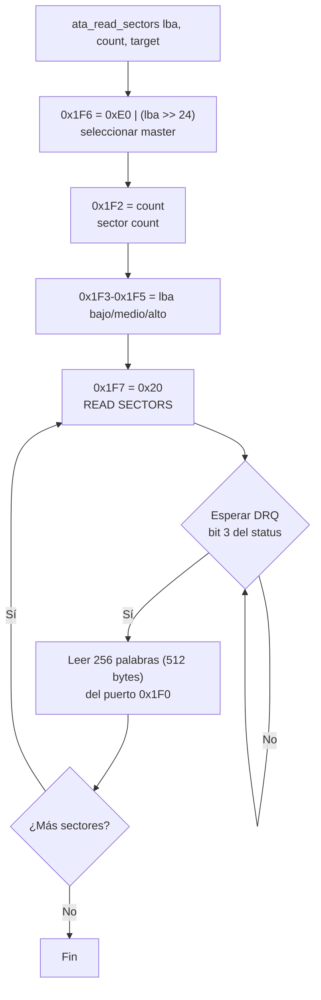
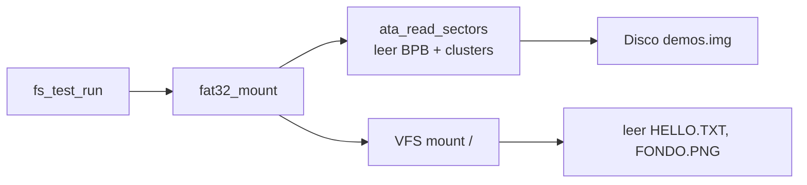

# Disco ATA/IDE (`src/drivers/ata.c` / `include/drivers/ata.h`)

## Qué es

El **driver ATA/IDE** lee sectores del disco usando el protocolo **PIO (Programmed I/O)** con direccionamiento **LBA28**. Se usa para leer el filesystem FAT32 del disco virtual `demos.img` que QEMU adjunta como disco primario.

## Puertos ATA (Primary Master)

| Puerto | Nombre | Propósito |
|--------|--------|-----------|
| `0x1F0` | Data | Lectura/escritura de datos (16 bits cada vez) |
| `0x1F1` | Error/Features | Estado de error |
| `0x1F2` | Sector Count | Número de sectores a transferir |
| `0x1F3` | LBA Low | Bits 0-7 de LBA |
| `0x1F4` | LBA Mid | Bits 8-15 de LBA |
| `0x1F5` | LBA High | Bits 16-23 de LBA |
| `0x1F6` | Drive/Head | Bits 24-27 de LBA + selección de drive |
| `0x1F7` | Status/Command | Estado y comandos |

## LBA28

Con **LBA28** (28 bits de dirección lógica de sector), el sector se especifica en:

```
LBA (28 bits) = [b27 ... b24 | b23 ... b16 | b15 ... b8  | b7 ... b0]
                     │            │              │             │
                 Register 0x1F6  Register 0x1F5  Register 0x1F4  Register 0x1F3
                 (bits 27-24)    (bits 23-16)    (bits 15-8)     (bits 7-0)
```

## Funcionamiento

El driver espera el estado **DRQ (Data Request)** y luego lee palabras de 16 bits en el bucle:

```c
void ata_read_sectors(uint32_t lba, uint8_t sector_count, uint8_t *target)
{
    // 1. Seleccionar drive (master) y LBA alto
    outb(0x1F6, 0xE0 | ((lba >> 24) & 0x0F));

    // 2. Configurar cantidad de sectores
    outb(0x1F2, sector_count);

    // 3. Enviar LBA bajo, medio y alto
    outb(0x1F3, (uint8_t)lba);
    outb(0x1F4, (uint8_t)(lba >> 8));
    outb(0x1F5, (uint8_t)(lba >> 16));

    // 4. Enviar comando READ SECTORS (0x20)
    outb(0x1F7, 0x20);

    // 5. Esperar DRQ y leer datos (palabras de 16 bits)
    for (int i = 0; i < sector_count * 256; i++) {
        // Esperar BSY clear y DRQ set...
        uint16_t *word = (uint16_t *)target;
        *word = inw(0x1F0);   // leer 2 bytes
        target += 2;
    }
}
```

## Diagrama de flujo



## Uso en el filesystem



El filesystem FAT32 usa este driver para leer:
1. El **boot sector** (BPB) con parámetros del filesystem.
2. Las tablas **FAT** (mapa de clusters).
3. Los **clusters de datos** de los archivos.

## API

```c
void ata_read_sectors(uint32_t lba, uint8_t sector_count, uint8_t *target);
```

| Argumento | Descripción |
|-----------|-------------|
| `lba` | Dirección lógica del sector (LBA28) |
| `sector_count` | Número de sectores (cada uno de 512 bytes) |
| `target` | Buffer de destino |

## Limitaciones

| Limitación | Descripción |
|------------|-------------|
| Solo lectura | No implementa escritura de sectores |
| PIO (no DMA) | Transfiere datos por el CPU, byte a byte |
| Solo master | Solo lee el disco primario master (0x1F0) |
| Sin interrupciones | Usa polling (espera activa en DRQ) |
