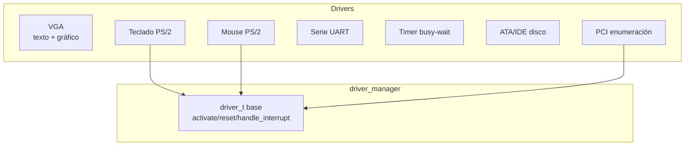

# Drivers

Los controladores de dispositivo de DemOS: salida por framebuffer VGA (modo texto y gráfico), teclado y mouse PS/2, puerto serie UART 16550, temporizador busy-wait, disco ATA/IDE y la enumeración del bus PCI.

## Resumen

## En esta sección

- [VGA modo texto](./vga-framebuffer/) — framebuffer 0xB8000, cursor, scroll (80x25)
- [VGA modo gráfico](./vga-grafico/) — Mode 13h 320x200x256, paleta, píxeles
- [Driver de teclado](./keyboard/) — scancodes PS/2 → caracteres ASCII
- [Driver de mouse](./mouse/) — paquetes PS/2 e interrupciones IRQ 12
- [Puerto serie](./serial/) — UART 16550 para depuración
- [Temporizador](./timer/) — delay() busy-wait
- [Disco ATA/IDE](./ata/) — lectura de sectores en modo PIO
- [PCI](./pci/) — configuración del bus y detección de dispositivos
