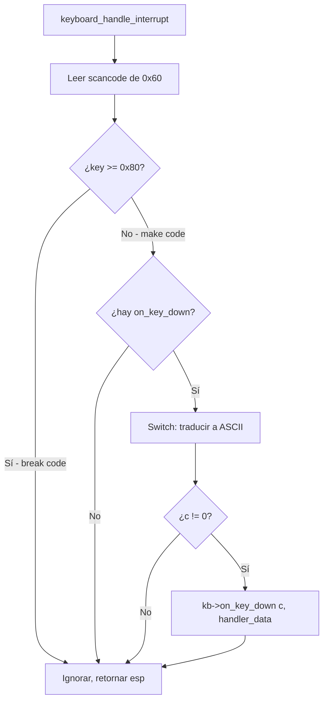
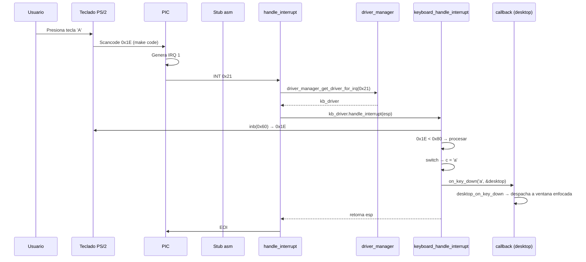

# Driver de teclado PS/2 (`include/drivers/keyboard.h` / `src/drivers/keyboard.c`)

## Qué es el driver de teclado

El **driver de teclado** maneja las interrupciones generadas por el teclado PS/2 (IRQ 1, interrupción `0x21`), lee los **scancodes** del puerto de datos `0x60`, los traduce a caracteres ASCII usando el layout **QWERTY Latinoamericano** y notifica las teclas a través de un **callback registrado** (`on_key_down`).

Los callbacks permiten desacoplar el driver del consumidor de eventos: el `desktop_t` (GUI) o el handler VGA por defecto.

## El controlador PS/2

El **controlador PS/2** (Intel 8042 o compatible) gestiona la comunicación entre el teclado y el CPU. DemOS lo configura para generar interrupciones cuando se presiona una tecla.

### Puertos del controlador

| Puerto | Nombre | Propósito |
|--------|--------|-----------|
| `0x60` | Data Port | Lee scancodes del teclado / escribe comandos de datos |
| `0x64` | Command/Status | Lee estado del controlador / escribe comandos de control |

### Registros de estado

| Bit | Nombre | Significado |
|-----|--------|-------------|
| 0 | OBF | Output Buffer Full - hay datos disponibles para leer |
| 1 | IBF | Input Buffer Full - el controlador está procesando un comando |
| 4 | TIME-OUT | Error de timeout |
| 5 | PARITY | Error de paridad |

### Comandos del controlador

| Comando | Puerto | Propósito |
|---------|--------|-----------|
| `0xAE` | `0x64` | Habilitar teclado PS/2 |
| `0xAD` | `0x64` | Deshabilitar teclado PS/2 |
| `0x20` | `0x64` | Leer byte de configuración del controlador |
| `0x60` | `0x64` | Escribir byte de configuración del controlador |

### Byte de configuración del controlador

| Bit | Nombre | Significado |
|-----|--------|-------------|
| 0 | IRQEN0 | Habilitar IRQ 0 (Timer) desde el controlador |
| 1 | IRQEN1 | Habilitar IRQ 1 (Teclado) desde el controlador |
| 4 | CLKDIS | Deshabilitar clock del teclado |
| 5 | Mouse | Habilitar mouse PS/2 |

## Scancodes Set 1

El teclado PS/2 envía **scancodes** (códigos de tecla) cuando se presiona o suelta una tecla. DemOS usa el **Set 1** (el más común).

### Estructura de un scancode

| Valor | Significado |
|-------|-------------|
| `0x00 - 0x7F` | **Make code** - tecla presionada |
| `0x80 - 0xFF` | **Break code** - tecla soltada (make code `\| 0x80`) |

DemOS solo procesa make codes (`< 0x80`); los break codes se ignoran.

### Tabla de traducción (QWERTY Latam)

| Scancode | ASCII | Tecla | Scancode | ASCII | Tecla |
|----------|-------|-------|----------|-------|-------|
| `0x02` | `1` | 1 | `0x10` | `q` | Q |
| `0x03` | `2` | 2 | `0x11` | `w` | W |
| `0x04` | `3` | 3 | `0x12` | `e` | E |
| `0x05` | `4` | 4 | `0x13` | `r` | R |
| `0x06` | `5` | 5 | `0x14` | `t` | T |
| `0x07` | `6` | 6 | `0x15` | `y` | Y |
| `0x08` | `7` | 7 | `0x16` | `u` | U |
| `0x09` | `8` | 8 | `0x17` | `i` | I |
| `0x0A` | `9` | 9 | `0x18` | `o` | O |
| `0x0B` | `0` | 0 | `0x19` | `p` | P |
| `0x1E` | `a` | A | `0x2C` | `z` | Z |
| `0x1F` | `s` | S | `0x2D` | `x` | X |
| `0x20` | `d` | D | `0x2E` | `c` | C |
| `0x21` | `f` | F | `0x2F` | `v` | V |
| `0x22` | `g` | G | `0x30` | `b` | B |
| `0x23` | `h` | H | `0x31` | `n` | N |
| `0x24` | `j` | J | `0x32` | `m` | M |
| `0x25` | `k` | K | `0x33` | `,` | , |
| `0x26` | `l` | L | `0x34` | `.` | . |
| `0x27` | `ñ` | Ñ | `0x35` | `-` | - |
| `0x1C` | `\n` | Enter | `0x0E` | `\b` | Backspace |
| `0x39` | ` ` | Space | | | |

## keyboard.h — Estructura del driver

```c
typedef struct {
    driver_t base;                  // Driver base (nombre, IRQ, punteros a función)

    uint16_t cursor_row;            // Posición del cursor de escritura
    uint16_t cursor_col;

    void *handler_data;             // Contexto del callback
    on_key_down_fn on_key_down;     // Callback para tecla presionada
    on_key_up_fn on_key_up;         // Callback para tecla soltada
} keyboard_driver_t;
```

### API

| Función | Propósito |
|---------|-----------|
| `keyboard_driver_init()` | Inicializa el driver y registra el callback |
| `keyboard_default_on_key_down()` | Handler por defecto: escribe en pantalla VGA |
| `keyboard_set_cursor()` | Establece la posición del cursor de escritura |

## src/drivers/keyboard.c — Implementación

### `keyboard_driver_init()` — Inicialización del driver

```c
void keyboard_driver_init(keyboard_driver_t *drv, on_key_down_fn on_key_down_fn, void *handler_data)
{
    drv->base.name = "keyboard";
    drv->base.irq = 0x21;                       // IRQ 1 → vector 0x21
    drv->base.activate = keyboard_activate;
    drv->base.reset = keyboard_reset;
    drv->base.deactivate = keyboard_deactivate;
    drv->base.handle_interrupt = keyboard_handle_interrupt;

    drv->cursor_row = 0;
    drv->cursor_col = 0;
    drv->on_key_down = on_key_down_fn;
    drv->on_key_up = NULL;
    drv->handler_data = handler_data ? handler_data : drv;
}
```

### `keyboard_activate()` — Activación del hardware

```c
static void keyboard_activate(driver_t *self)
{
    keyboard_driver_t *kb = (keyboard_driver_t *)self;

    while (inb(KB_COMMAND_PORT) & 0x1) {        // Drenar buffer
        inb(KB_DATA_PORT);
    }

    outb(KB_COMMAND_PORT, 0xAE);                // Activar teclado PS/2

    while (inb(KB_COMMAND_PORT) & 0x2) {}       // Esperar IBF clear
    outb(KB_COMMAND_PORT, 0x20);                // Leer configuración
    while (!(inb(KB_COMMAND_PORT) & 0x1)) {}    // Esperar OBF set
    uint8_t status = (inb(KB_DATA_PORT) | 1) & ~0x10;  // IRQ1 on, clock on
    while (inb(KB_COMMAND_PORT) & 0x2) {}
    outb(KB_COMMAND_PORT, 0x60);                // Seleccionar registro
    while (inb(KB_COMMAND_PORT) & 0x2) {}
    outb(KB_DATA_PORT, status);                 // Escribir configuración
    while (inb(KB_COMMAND_PORT) & 0x2) {}
    outb(KB_DATA_PORT, 0xF4);                   // Habilitar escaneo

    active_keyboard = kb;

    serial_write_string(COM1_BASE_ADDRESS, "[KB] Keyboard activated\n", 24);
}
```

**Paso a paso:**

| Paso | Qué hace | Por qué |
|------|----------|---------|
| 1. Drenar buffer | Leer y descartar datos pendientes | Evitar scancodes residuales |
| 2. `0xAE` al `0x64` | Habilitar el teclado | Asegurar que el teclado esté activo |
| 3. Esperar IBF clear | Verificar que el controlador no está ocupado | Evitar perder comandos |
| 4. `0x20` al `0x64` | Leer byte de configuración | Obtener el estado actual |
| 5. Esperar OBF set | Verificar que el byte de configuración está disponible | Leer datos válidos |
| 6. `\| 1` y `& ~0x10` | Bit 0 = 1 (habilitar IRQ1), bit 4 = 0 (habilitar clock) | Permitir que el teclado genere interrupciones |
| 7. Escribir configuración | Aplicar los cambios | |
| 8. `0xF4` al `0x60` | Habilitar escaneo | El teclado empezará a enviar scancodes |

> **Nota**: Los guards IBF (bit 1 de `0x64`) y OBF (bit 0 de `0x64`) son críticos. Sin ellos, los comandos se pierden si el controlador está ocupado procesando un dato anterior.

### `keyboard_handle_interrupt()` — Manejo de interrupciones

```c
static uint32_t keyboard_handle_interrupt(driver_t *self, uint32_t esp)
{
    keyboard_driver_t *kb = (keyboard_driver_t *)self;
    uint8_t key = inb(KB_DATA_PORT);        // Leer scancode

    if (key >= 0x80)                        // Break code → ignorar
        return esp;

    if (!kb->on_key_down)                   // Sin callback registrado
        return esp;

    char c = 0;

    switch (key) {
    case 0x02: c = '1'; break;
    // ... (tabla completa)
    case 0x27: c = (char)0xF1; break;       // ñ (CP-437)
    case 0x1C: c = '\n'; break;
    case 0x39: c = ' '; break;
    case 0x0E: c = '\b'; break;
    default: break;                         // Scancode desconocido
    }

    if (c != 0) {
        kb->on_key_down(c, kb->handler_data);  // Notificar al consumidor
    }

    return esp;
}
```



### `keyboard_default_on_key_down()` — Handler VGA por defecto

Este handler escribe el carácter en la pantalla en modo texto, pero en el sistema actual el kernel registra `desktop_on_key_down` (GUI) como callback en su lugar.

## Flujo completo: tecla presionada



## Dependencias

| Módulo | Función usada |
|--------|---------------|
| `asm.h` | `inb()`, `outb()` |
| `drivers/driver.h` | `driver_t`, callbacks |
| `drivers/serial.h` | `serial_write_string()` |
| `drivers/vga_legacy.h` | `SCREEN_COLS/ROWS`, `write_letter_to_buffer()`, `move_cursor()`, `scroll()` |
