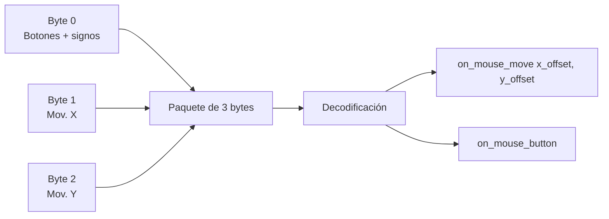
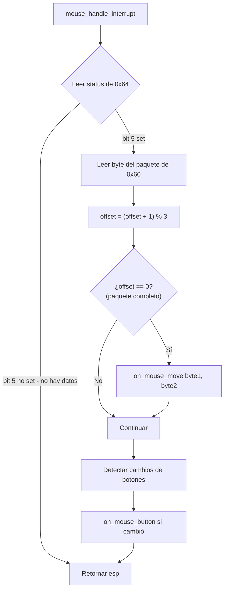
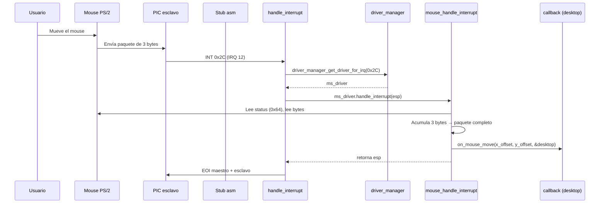

# Driver de mouse PS/2 (`include/drivers/mouse.h` / `src/drivers/mouse.c`)

## Qué es el driver de mouse

El **driver de mouse** maneja las interrupciones generadas por el mouse PS/2 (IRQ 12, interrupción `0x2C`), lee los **paquetes de 3 bytes** del puerto de datos `0x60`, los decodifica en movimiento y botones, y notifica los eventos a través de callbacks registrados (`on_mouse_move`, `on_mouse_button`).

Incluye un handler por defecto que dibuja un cursor VGA por **inversión de colores** (XOR), pero en el sistema actual se usa `desktop_on_mouse_move` (GUI).

## El mouse PS/2

El mouse PS/2 envía paquetes de **3 bytes** cada vez que se mueve o se presiona/suelta un botón:

```
Byte 0: Botones + flags
  Bit 0: Botón izquierdo
  Bit 1: Botón derecho
  Bit 2: Botón central
  Bit 3: Siempre 1
  Bit 4: Movimiento X negativo (signo)
  Bit 5: Movimiento Y negativo (signo)
  Bit 6: Overflow X
  Bit 7: Overflow Y

Byte 1: Movimiento X (offset desde último paquete)
Byte 2: Movimiento Y (offset desde último paquete)
```



## mouse.h — Estructura del driver

```c
typedef struct {
    driver_t base;              // Driver base (nombre, IRQ, punteros a función)

    uint8_t buffer[3];          // Buffer de 3 bytes para el paquete
    uint8_t offset;             // Byte actual del paquete (0-2)
    uint8_t buttons;            // Estado previo de los botones
    int8_t x;                   // Posición X (0-79)
    int8_t y;                   // Posición Y (0-24)

    void *handler_data;         // Contexto del callback
    on_mouse_move_fn on_mouse_move;
    on_mouse_button_fn on_mouse_button;
} mouse_driver_t;
```

### API

| Función | Propósito |
|---------|-----------|
| `mouse_driver_init()` | Inicializa el driver y registra el callback |
| `mouse_default_on_move()` | Handler por defecto: cursor VGA XOR |

## src/drivers/mouse.c — Implementación

### `mouse_driver_init()` — Inicialización del driver

```c
void mouse_driver_init(mouse_driver_t *drv, on_mouse_move_fn on_move, void *data)
{
    drv->base.name = "mouse";
    drv->base.irq = 0x2C;                       // IRQ 12 → vector 0x2C
    drv->base.activate = mouse_activate;
    drv->base.reset = mouse_reset;
    drv->base.deactivate = mouse_deactivate;
    drv->base.handle_interrupt = mouse_handle_interrupt;

    drv->offset = 0;
    drv->buttons = 0;
    drv->x = 40;                                // Centro de pantalla
    drv->y = 12;
    drv->on_mouse_move = on_move;
    drv->on_mouse_button = NULL;
    drv->handler_data = data ? data : drv;
}
```

### `mouse_activate()` — Activación del hardware

```c
static void mouse_activate(driver_t *self)
{
    mouse_driver_t *ms = (mouse_driver_t *)self;

    ms->offset = 0;
    ms->buttons = 0;
    ms->x = 40;
    ms->y = 12;

    while (inb(MS_COMMAND_PORT) & 0x1) {        // Drenar buffer
        inb(MS_DATA_PORT);
    }

    outb(MS_COMMAND_PORT, 0xA8);                // Habilitar segundo puerto PS/2

    outb(MS_COMMAND_PORT, 0x20);                // Leer configuración
    while (!(inb(MS_COMMAND_PORT) & 0x1)) {}
    uint8_t status = (inb(MS_DATA_PORT) | 2);   // Bit 1: habilitar IRQ12
    outb(MS_COMMAND_PORT, 0x60);                // Escribir configuración
    while (inb(MS_COMMAND_PORT) & 0x2) {}
    outb(MS_DATA_PORT, status);

    outb(MS_COMMAND_PORT, 0xD4);                // Preparar comando para mouse
    while (inb(MS_COMMAND_PORT) & 0x2) {}
    outb(MS_DATA_PORT, 0xF4);                   // Habilitar escaneo del mouse

    active_mouse = ms;

    serial_write_string(COM1_BASE_ADDRESS, "[MS] Mouse activated\n", 22);
}
```

**Paso a paso:**

| Paso | Qué hace | Por qué |
|------|----------|---------|
| 1. Drenar buffer | Leer y descartar datos pendientes | Evitar paquetes residuales |
| 2. `0xA8` al `0x64` | Habilitar el segundo puerto PS/2 (mouse) | Activar hardware del mouse |
| 3. `0x20` al `0x64` | Leer byte de configuración del controlador | Obtener estado actual |
| 4. `\| 2` | Bit 1 = 1 (habilitar IRQ12) | Permitir que el mouse genere interrupciones |
| 5. Escribir configuración | Aplicar los cambios | |
| 6. `0xD4` al `0x64` | Indicar que el siguiente dato es para el mouse | Los comandos del mouse van vía 0xD4 |
| 7. `0xF4` al `0x60` | Habilitar escaneo del mouse | El mouse empezará a enviar paquetes |

> **Nota**: El comando `0xD4` es necesario porque el puerto de datos `0x60` está compartido entre teclado y mouse. Sin `0xD4`, el `0xF4` se enviaría al teclado en lugar del mouse.

### `mouse_handle_interrupt()` — Manejo de interrupciones

```c
static uint32_t mouse_handle_interrupt(driver_t *self, uint32_t esp)
{
    mouse_driver_t *ms = (mouse_driver_t *)self;

    uint8_t status = inb(MS_COMMAND_PORT);
    if (!(status & 0x20)) {         // Bit 5: datos disponibles para mouse
        return esp;
    }

    ms->buffer[ms->offset] = inb(MS_DATA_PORT);
    ms->offset = (ms->offset + 1) % 3;

    if (ms->offset == 0) {          // Paquete completo (3 bytes)
        if (ms->on_mouse_move) {
            ms->on_mouse_move((int8_t)ms->buffer[1], (int8_t)ms->buffer[2], ms->handler_data);
        }
    }

    // Detectar cambios en botones
    for (uint8_t i = 0; i < 3; i++) {
        if ((ms->buffer[0] & (0x01 << i)) != (ms->buttons & (0x01 << i))) {
            if (ms->on_mouse_button) {
                bool pressed = (ms->buffer[0] & (0x01 << i)) != 0;
                ms->on_mouse_button(i, ms->x, ms->y, pressed, ms->handler_data);
            }
        }
    }
    ms->buttons = ms->buffer[0];

    return esp;
}
```



### Detección de botones

Cada botón se compara con el estado anterior (`buttons`). Cuando hay un cambio, se llama `on_mouse_button` indicando si fue presionado o soltado:

| Bit | Botón |
|-----|-------|
| 0 | Izquierdo |
| 1 | Derecho |
| 2 | Central |

### `mouse_default_on_move()` — Handler por defecto (cursor VGA)

Este handler dibuja un cursor visual **invirtiendo los colores** (foreground ↔ background) de la celda VGA en la posición del mouse:

```c
void mouse_default_on_move(int8_t x_offset, int8_t y_offset, void *data)
{
    mouse_driver_t *ms = (mouse_driver_t *)data;
    static uint16_t *video_memory = (uint16_t *)0xB8000;

    // Restaurar celda anterior (swap de colores inverso)
    video_memory[(80 * ms->y) + ms->x] = ...;

    // Actualizar posición con clamping
    ms->x = (int8_t)(ms->x + x_offset);
    if (ms->x < 0) ms->x = 0;
    if (ms->x >= 80) ms->x = 79;

    ms->y = (int8_t)(ms->y - y_offset);
    if (ms->y < 0) ms->y = 0;
    if (ms->y >= 25) ms->y = 24;

    // Resaltar nueva celda (swap de colores)
    video_memory[(80 * ms->y) + ms->x] = ...;
}
```

#### Clamping de posición

Las coordenadas `x` e `y` son `int8_t` (rango -128 a 127) para manejar movimientos negativos. Se clampean a los límites de la pantalla:

| Coordenada | Mínimo | Máximo |
|------------|--------|--------|
| `x` (columna) | 0 | 79 |
| `y` (fila) | 0 | 24 |

> **Nota**: Este handler es el *default*. En el sistema actual, `main.c` registra `desktop_on_mouse_move` (que dibuja el cursor en modo gráfico 320x200) en lugar de este.

## Flujo completo: mouse movido



## Dependencias

| Módulo | Función usada |
|--------|---------------|
| `asm.h` | `inb()`, `outb()` |
| `drivers/driver.h` | `driver_t`, callbacks |
| `drivers/serial.h` | `serial_write_string()` |
| `drivers/vga_legacy.h` | Acceso directo a framebuffer VGA (default handler) |
