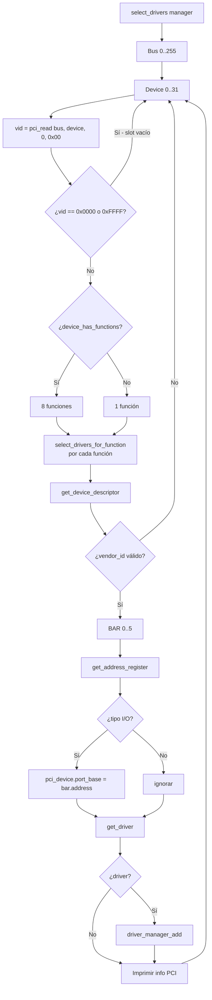

# Controlador PCI — Configuración del bus periférico (`include/kernel/pci.h` / `src/kernel/pci.c`)

## Qué es PCI

**PCI (Peripheral Component Interconnect)** es un bus de datos que conecta los dispositivos (tarjetas de video, controladores, etc.) al CPU/motherboard. En lugar de usar direcciones de memoria arbitrarias, los dispositivos PCI exponen un **espacio de configuración**: un conjunto de registros (256 bytes) accesibles mediante dos puertos de E/S del x86.

## Por qué necesita DemOS un controlador PCI

DemOS usa PCI para:

1. **Detectar dispositivos** conectados al bus (VGA, controladores, etc.).
2. **Leer su dirección de E/S** (I/O ports) a través de los **Base Address Registers (BAR)**.
3. **Seleccionar e instalar drivers** compatibles en el `driver_manager_t`.

El escaneo es iniciado desde `main.c` llamando a `select_drivers(&global_driver_manager)` durante la fase de inicialización del kernel.

## Espacio de configuración PCI

| Registro | Offset | Tamaño | Descripción |
|----------|--------|--------|-------------|
| `0x00` | 0 | 16 | `vendor_id` (0x0000/0xFFFF = slot vacío) |
| `0x02` | 2 | 16 | `device_id` |
| `0x08` | 8 | 8 | `revision_id` |
| `0x09` | 9 | 8 | `interface_id` |
| `0x0A` | 10 | 8 | `sub_class_id` |
| `0x0B` | 11 | 8 | `class_id` |
| `0x0E` | 14 | 8 | `header_type` (bit 7 = multifunción) |
| `0x10` | 16 | 32 | `BAR0` (... hasta `BAR5` en 0x24) |
| `0x3C` | 60 | 8 | `interrupt` (IRQ asignada) |

## Puertos de E/S del x86

DemOS configura los registros de configuración escribiendo un **dword de dirección** (32 bits) en el puerto `0xCF8` y leyendo/escribiendo los **datos** en el puerto `0xCFC`.

```
Dirección (0xCF8):  [31]  [30:24]  [23:16]  [15:11]  [10:8]  [7:2]     [1:0]
                    Enable  0       Bus      Device   Funct   Reg offset  0
                                               (0-255)  (0-31)   (0-255)
```

- **Bus (8 bits)**: número de bus PCI (0-255).
- **Device (5 bits)**: número de dispositivo en el slot (0-31).
- **Function (3 bits)**: función del dispositivo (0-7); usado por dispositivos multifunción.
- **Register offset (6 bits, alineado a 4)**: registro dentro del dispositivo (0-255, siempre múltiplo de 4).

## include/kernel/pci.h — Tipos

### `pci_device_descriptor`

```c
typedef struct {
    uint32_t port_base;      // Dirección de puerto de E/S (desde un BAR)
    uint32_t interrupt;      // IRQ asignada
    uint16_t bus;
    uint16_t device;
    uint16_t funtion;
    uint16_t vendor_id;
    uint16_t device_id;
    uint8_t class_id;
    uint8_t sub_class_id;
    uint8_t interface_id;
    uint8_t revision;
} pci_device_descriptor;
```

### `base_address_register`

```c
enum base_address_register_type { memory_mapping = 0, input_output = 1 };

typedef struct {
    bool prefetchable;
    uint8_t *address;
    uint32_t size;
    enum base_address_register_type type;
} base_address_register;
```

### API

| Función | Propósito |
|---------|-----------|
| `pci_read()` | Lee un dword del espacio de configuración (0xCF8/0xCFC) |
| `pci_write()` | Escribe un dword en el espacio de configuración |
| `device_has_functions()` | Comprueba si es multifunción (bit 7 de header_type) |
| `get_device_descriptor()` | Rellena un `pci_device_descriptor` |
| `get_address_register()` | Lee un BAR (0-5), determina tipo y dirección |
| `get_driver()` | Identifica el dispositivo y retorna un `driver_t*` (o NULL) |
| `select_drivers()` | Escanea todo el bus PCI y registra drivers |

## src/kernel/pci.c — Implementación

### `pci_read()` — Lectura de configuración

```c
uint32_t pci_read(uint16_t bus, uint16_t device, uint16_t funtion, uint32_t register_offset)
{
    uint32_t id = (0x1 << 31) | ((bus & 0xFF) << 16) | ((device & 0x1F) << 11) |
                  ((funtion & 0x07) << 8) | (register_offset & 0xFC);

    outl(PCI_COMMAND_PORT, id);          // 0xCF8: dirección
    uint32_t result = inl(PCI_DATA_PORT); // 0xCFC: datos
    return result >> (8 * (register_offset % 4));
}
```

El offset se enmascara con `0xFC` para alinearlo a 4 bytes. Como se puede pedir cualquier offset (0-255), el resultado se desplaza para extraer el campo solicitado.

### `device_has_functions()` — Multifunción

```c
bool device_has_functions(uint32_t bus, uint16_t device)
{
    return (pci_read(bus, device, 0, 0x0E) & (1 << 7)) != 0;
}
```

### `get_device_descriptor()` — Rellenar descriptor

```c
void get_device_descriptor(uint16_t bus, uint16_t device, uint16_t funtion,
                           pci_device_descriptor *out)
{
    out->bus = bus;
    out->device = device;
    out->funtion = funtion;

    out->vendor_id = pci_read(bus, device, funtion, 0x00);
    out->device_id = pci_read(bus, device, funtion, 0x02);

    out->class_id = pci_read(bus, device, funtion, 0x0b);
    out->sub_class_id = pci_read(bus, device, funtion, 0x0a);
    out->interface_id = pci_read(bus, device, funtion, 0x09);

    out->revision = pci_read(bus, device, funtion, 0x08);
    out->interrupt = pci_read(bus, device, funtion, 0x3c);
}
```

### `get_address_register()` — Base Address Register (BAR)

```c
void get_address_register(uint16_t bus, uint16_t device, uint16_t funtion,
                          uint16_t bar, base_address_register *out)
{
    out->type = memory_mapping;
    out->address = (uint8_t *)0;
    out->size = 0;
    out->prefetchable = false;

    uint32_t header_type = pci_read(bus, device, funtion, 0x0E) & 0x7F;
    uint32_t max_bars = 6 - (4 * header_type);
    if (bar >= max_bars) {
        return;
    }

    uint32_t bar_value = pci_read(bus, device, funtion, 0x10 + (4 * bar));
    out->type = (bar_value & 0x1) ? input_output : memory_mapping;

    if (out->type == memory_mapping) {
        /* TODO: report BAR size/64-bit */
    } else /* InputOutput */ {
        out->address = (uint8_t *)(bar_value & ~0x3U);
        out->prefetchable = false;
    }
}
```

- El `header_type` (sin el bit multifunción) determina cuántos BARs son válidos. Para dispositivos normales (`header_type == 0`), hay 6 BARs (0-5); para puentes PCI (`header_type == 1`), solo 2.
- El **bit 0** del valor del BAR indica el tipo: `1` = **I/O** (puerto de E/S), `0` = **memoria mapeada**.
- Para **I/O**, la dirección del puerto es `bar_value & ~0x3` (los 2 bits bajos son flags). Este `address` se propaga a `pci_device_descriptor.port_base`.

### `get_driver()` — Identificación de dispositivos

```c
driver_t *get_driver(pci_device_descriptor *device)
{
    driver_t *driver = (driver_t *)0;

    switch (device->vendor_id) {
    case 0x1022: /* AMD */
        switch (device->device_id) {
        case 0x2000: /* am79c973 */
            serial_write_string(COM1_BASE_ADDRESS, "[PCI] AMD am79c973 ", 19);
            break;
        default: break;
        }
        break;
    default: /* Intel (0x8086) y otros: sin driver */
        break;
    }

    switch (device->class_id) {
    case 0x03: /* graphics */
        switch (device->sub_class_id) {
        case 0x00: /* VGA */
            serial_write_string(COM1_BASE_ADDRESS, "[PCI] VGA ", 10);
            break;
        default: break;
        }
        break;
    default: break;
    }

    return driver;   // Siempre NULL por ahora (esqueleto)
}
```

| vendor_id | Fabricante | Comentario |
|-----------|------------|------------|
| `0x1022` | AMD | Se reconoce `0x2000` (am79c973) |
| `0x8086` | Intel | Reservado (sin driver aún) |

| class_id | Subclase (sub_class_id) | Dispositivo |
|----------|--------------------------|-------------|
| `0x03` | `0x00` | VGA/graphics controller |
| `0x01` | `0x01`/`0x02` | Controlador SATA/IDE |
| `0x0C` | `0x03` | USB controller |

`get_driver()` **retorna siempre NULL** por ahora: es un esqueleto que identifica e imprime el dispositivo, pero aún no construye ningún `driver_t`. Esto permite extenderlo añadiendo casos concretos.

### `select_drivers()` — Enumeración del bus

```c
void select_drivers(driver_manager_t *manager)
{
    serial_write_string(COM1_BASE_ADDRESS, "[PCI] scan start\n", 17);

    for (uint16_t bus = 0; bus < 256; bus++) {
        for (uint16_t device = 0; device < 32; device++) {
            uint16_t vid = (uint16_t)pci_read(bus, device, 0, 0x00);
            if (vid == 0x0000 || vid == 0xFFFF) {
                continue;   // Slot vacío
            }

            int num_functions = device_has_functions(bus, device) ? 8 : 1;
            for (int function = 0; function < num_functions; function++) {
                select_drivers_for_function(bus, device, (uint16_t)function, manager);
            }
        }
    }
    serial_write_string(COM1_BASE_ADDRESS, "[PCI] scan done\n", 16);
}
```

El escaneo recorre **todos los buses (0-255)**, **dispositivos (0-31)** y sus **funciones**. La lógica de cada `(bus, device, function)` se extrajo a `select_drivers_for_function()` para mantener la legibilidad:



**`select_drivers_for_function()`** imprime la información de cada dispositivo por el puerto serie:

```
[PCI] B:0 D:2 F:0 V:8086 DEV:1237
[PCI] VGA
```

El formato es: `[PCI] B:<bus> D:<device> F:<function> V:<vendor> DEV:<device_id>`.

## Dependencias

| Módulo | Función usada |
|--------|---------------|
| `asm.h` | `outl()`, `inl()` |
| `drivers/driver.h` | `driver_t`, `driver_manager_t`, `driver_manager_add()` |
| `drivers/serial.h` | `serial_write_string()`, `serial_write_hex16()`, `serial_write_u8()` |
