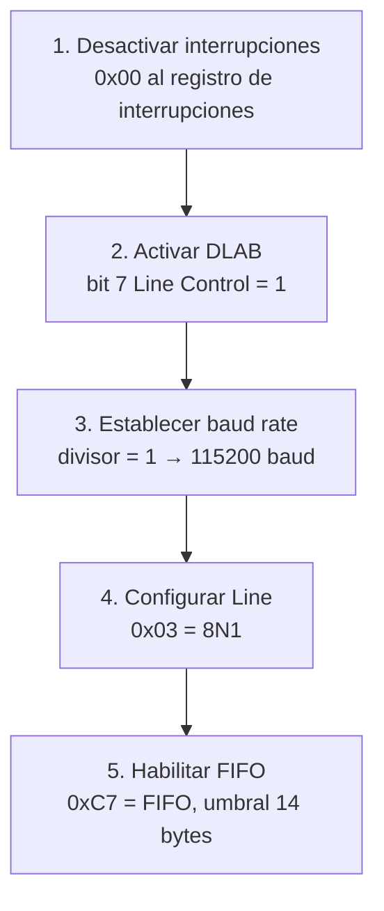

# Puerto serie — UART 16550 (`include/drivers/serial.h` / `src/drivers/serial.c`)

## Qué es el puerto serie

El **puerto serie** (UART — Universal Asynchronous Receiver/Transmitter) es un canal de comunicación bidireccional que transmite datos un bit a la vez. En desarrollo de kernels, el puerto serie es la herramienta de depuración más fiable porque funciona sin drivers de video ni sistemas de archivos.

DemOS usa el chip **16550** (o compatible) en el puerto **COM1** (`0x3F8`) para enviar mensajes de depuración a través de QEMU (`-serial stdio`).

## Por qué usar el puerto serie

| Ventaja | Explicación |
|---------|-------------|
| Sin dependencias | No necesita framebuffer, drivers de video ni sistema de archivos |
| Siempre disponible | El hardware UART existe en todas las placas x86 |
| Output visible | QEMU redirige el serie a la terminal con `-serial stdio` |
| Simple | Solo escribe bytes a un puerto de E/S |

## Mapa de memoria del UART

DemOS usa **COM1** (base `0x3F8`) y **COM2** (base `0x2F8`):

| Puerto COM1 | Puerto COM2 | Registro |
|-------------|-------------|----------|
| `0x3F8` | `0x2F8` | Data (TX/RX) |
| `0x3F9` | `0x2F9` | Interrupt Enable |
| `0x3FA` | `0x2FA` | FIFO Control |
| `0x3FB` | `0x2FB` | Line Control |
| `0x3FD` | `0x2FD` | Line Status |

### Registros

| Registro | Propósito |
|----------|-----------|
| **Data** | Envía/recibe un byte |
| **Interrupt Enable** | Habilita/deshabilita interrupciones del UART |
| **FIFO Control** | Activa/deshabilita la cola FIFO de 16 bytes |
| **Line Control** | Configura formato: bits de datos, paridad, stop bits |
| **Line Status** | Estado de transmisión y recepción |

## serial.h — Definiciones

```c
#define COM1_BASE_ADDRESS 0x3F8
#define COM2_BASE_ADDRESS 0x2F8

#define SERIAL_DATA_PORT(base_address)        ((base_address))
#define SERIAL_INTERRUPT_PORT(base_address)   ((base_address) + 1)
#define SERIAL_FIFO_CMD_PORT(base_address)    ((base_address) + 2)
#define SERIAL_LINE_CMD_PORT(base_address)    ((base_address) + 3)
#define SERIAL_LINE_STATUS_PORT(base_address) ((base_address) + 5)

static const char hex_chars[] = "0123456789ABCDEF";
```

Las macros calculan la dirección de cada registro a partir de la base del puerto.

### API

| Función | Propósito |
|---------|-----------|
| `serial_init(com)` | Inicializa el UART en 8N1 |
| `serial_write(com, data)` | Envía un byte |
| `serial_write_string(com, buf, len)` | Envía una cadena |
| `serial_write_hex16(com, value)` | Envía un valor de 16 bits en hex |
| `serial_write_u8(com, value)` | Envía un valor de 8 bits en decimal |
| `serial_read(com)` | Lee un byte (bloqueante) |
| `is_transmition_buffer_empty(com)` | Verifica si el buffer TX está vacío |
| `is_data_received(com)` | Verifica si hay datos RX |

## serial.c — Implementación

### `serial_init()` — Inicialización del UART

```c
void serial_init(uint16_t com)
{
    outb(SERIAL_INTERRUPT_PORT(com), 0x00);           // Desactivar interrupciones
    outb(SERIAL_LINE_CMD_PORT(com), 0x80);            // DLAB = 1 (acceder a divisor)
    outb(SERIAL_DATA_PORT(com), divisor & 0x00FF);    // Divisor bajo (baud rate)
    outb(SERIAL_DATA_PORT(com) + 1, (divisor >> 8) & 0x00FF); // Divisor alto
    outb(SERIAL_LINE_CMD_PORT(com), 0x03);            // 8N1
    outb(SERIAL_FIFO_CMD_PORT(com), 0xC7);            // Habilitar FIFO, umbral 14
}
```

**Pasos de inicialización:**



| Paso | Qué hace |
|------|----------|
| 1. Desactivar interrupciones | Escribe `0x00` al registro de interrupciones |
| 2. Activar DLAB | Bit 7 del registro Line Control = 1 para acceder al divisor de baudios |
| 3. Establecer baud rate | Divisor = 1 → 115200 baudios (velocidad máxima) |
| 4. Configurar Line | `0x03` = 8 bits de datos, sin paridad, 1 bit de stop (8N1) |
| 5. Habilitar FIFO | `0xC7` = activar FIFO, umbral de 14 bytes |

### Formato 8N1

```
[Start][D0][D1][D2][D3][D4][D5][D6][D7][Stop]
   1b    ---- 8 bits de datos ----       1b
```

| Campo | Valor |
|-------|-------|
| Data bits | 8 |
| Parity | Ninguna |
| Stop bits | 1 |

### `serial_write()` — Envío de un byte

```c
void serial_write(uint16_t com, uint8_t data)
{
    while (!is_transmition_buffer_empty(com)) {}
    outb(SERIAL_DATA_PORT(com), data);
}
```

**Espera activa** hasta que el buffer de transmisión esté vacío, luego escribe el byte en el registro Data.

### `serial_write_string()` — Envío de cadena

```c
void serial_write_string(uint16_t com, const char *buffer, uint32_t len)
{
    for (uint32_t i = 0; i < len; i++)
        serial_write(com, buffer[i]);
}
```

### `serial_write_hex16()` — Formato hexadecimal

```c
void serial_write_hex16(uint16_t com, uint16_t value)
{
    serial_write(com, hex_chars[(value >> 12) & 0xF]);
    serial_write(com, hex_chars[(value >> 8) & 0xF]);
    serial_write(com, hex_chars[(value >> 4) & 0xF]);
    serial_write(com, hex_chars[value & 0xF]);
}
```

### `serial_write_u8()` — Formato decimal

```c
void serial_write_u8(uint16_t com, uint8_t value)
{
    if (value >= 100) serial_write(com, '0' + (value / 100));
    if (value >= 10)  serial_write(com, '0' + ((value / 10) % 10));
    serial_write(com, '0' + (value % 10));
}
```

### `serial_read()` — Recepción de un byte

```c
char serial_read(uint16_t com)
{
    while (!is_data_received(com)) {}
    return (char)inb(SERIAL_DATA_PORT(com));
}
```

**Bloqueante**: espera hasta que haya datos disponibles en el buffer de recepción.

### Funciones de estado

```c
int8_t is_transmition_buffer_empty(uint16_t com)
{
    return (int8_t)((inb(SERIAL_LINE_STATUS_PORT(com)) & 0x20) == 0x20);
}

int8_t is_data_received(uint16_t com)
{
    return (int8_t)((inb(SERIAL_LINE_STATUS_PORT(com)) & 0x01) == 0x01);
}
```

| Función | Bit del LSR | Significado |
|---------|-------------|-------------|
| `is_transmition_buffer_empty` | Bit 5 (THRE) | Buffer TX listo para recibir datos |
| `is_data_received` | Bit 0 (DR) | Hay datos esperando ser leídos |

## Registro Line Status (LSR)

| Bit | Nombre | Significado |
|-----|--------|-------------|
| 0 | DR | Data Ready - hay datos para leer |
| 1 | OE | Overrun Error - dato perdido |
| 2 | PE | Parity Error |
| 3 | FE | Framing Error |
| 4 | BI | Break Interrupt |
| 5 | THRE | Transmitter Holding Register Empty |
| 6 | TEMT | Transmitter Empty |

## Uso según el módulo

El puerto serie se usa ampliamente en todo el kernel para depuración:

```mermaid
graph TB
    MAIN[main.c<br/>[KERNEL] Stage messages]
    GDT[gdt.c<br/>[GDT] Descriptors filled]
    KB[keyboard.c<br/>[KB] Keyboard activated]
    MS[mouse.c<br/>[MS] Mouse activated]
    PCI[pci.c<br/>[PCI] B:/D:/F:/V:/DEV:]
    FS[fat32/fstest<br/>[FS] mount/read]

    MAIN --> DEB[Puerto serie COM1]
    GDT --> DEB
    KB --> DEB
    MS --> DEB
    PCI --> DEB
    FS --> DEB
    DEB --> QEMU[qemu -serial stdio]
```

## Uso desde QEMU

Para ver la salida del serie en la terminal:

```bash
qemu-system-i386 -cdrom DemOS.iso -drive file=demos.img,format=raw,if=ide -serial stdio
```

Todos los `serial_write_string()` se imprimen en la terminal donde se ejecutó QEMU.
