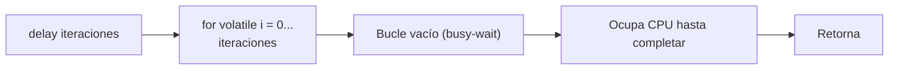
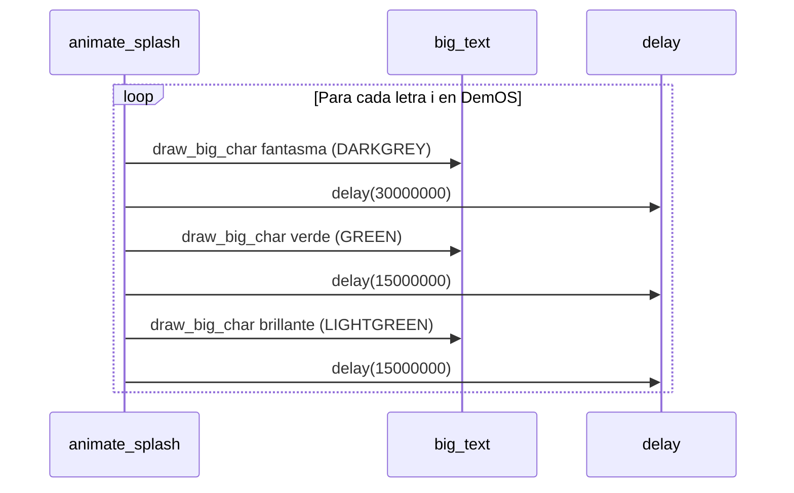

# Temporizador — delay() busy-wait (`include/drivers/timer.h` / `src/drivers/timer.c`)

## Qué es

DemOS implementa una función de **espera activa** (busy-wait) para crear pausas. Es la forma más simple de temporización en un kernel sin un controlador PIT/APIC configurado.

## Implementación

```c
void delay(uint32_t iterations)
{
    for (volatile uint32_t i = 0; i < iterations; i++) {
        ;
    }
}
```

## Funcionamiento



- **`volatile`** evita que el compilador optimice el bucle y lo elimine.
- La duración **depende de la velocidad del CPU** y de QEMU.
- No es precisa, pero es suficiente para animaciones simples.

## Valores típicos

| Uso | Iteraciones | Efecto aprox. (QEMU) |
|-----|-------------|----------------------|
| Transición rápida | 15,000,000 | ~0.15s |
| Pausa entre letras | 30,000,000 | ~0.3s |
| Pulso colectivo | 40,000,000 | ~0.4s |
| Pausa larga | 60,000,000 | ~0.6s |

## Uso en el splash

La animación `animate_splash()` usa `delay()` para crear el efecto de transición de color letra por letra:



## Limitaciones

| Limitación | Descripción |
|------------|-------------|
| Bloqueante | Bloquea todo el CPU durante la espera |
| No precisa | La duración varía según la velocidad del CPU |
| Sin planificación | Impiden que otros procesos corran |

> **Nota**: En un kernel más avanzado se usaría el **PIT (Programmable Interval Timer)** o el **APIC timer** con interrupciones, pero DemOS mantiene la simplicidad del busy-wait.
