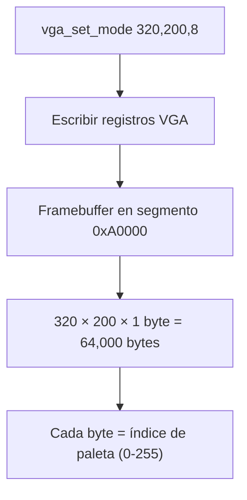
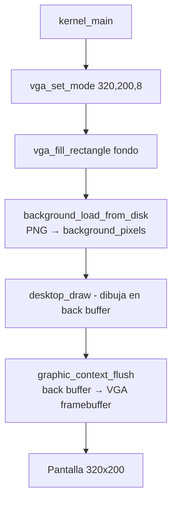

# VGA modo gráfico — Mode 13h 320x200x8 (`src/drivers/vga.c` / `include/drivers/vga.h`)

## ¿Qué es?

El kernel cambia a **modo gráfico** (Mode 13h / modo 320x200x256) para mostrar el escritorio y las ventanas. En este modo, cada píxel es un **índice de color de 8 bits** apuntando a una paleta de 256 colores.



## Propiedades del modo

| Propiedad | Valor |
|-----------|-------|
| Resolución | 320 × 200 píxeles |
| Profundidad | 8 bits por píxel (256 colores) |
| Framebuffer | Segmento `0xA0000` (memoria de video) |
| Tamaño del buffer | 320 × 200 = 64,000 bytes |
| Paleta | 256 entradas × 3 canales (R,G,B en 6 bits cada uno) |

## Registros VGA

| Puerto | Nombre | Propósito |
|--------|--------|-----------|
| `0x3C2` | MISC | Registro misceláneo |
| `0x3C4` | Sequencer Index | Selecciona registro del secuenciador |
| `0x3C5` | Sequencer Data | Datos del secuenciador |
| `0x3D4` | CRTC Index | Selecciona registro CRTC |
| `0x3D5` | CRTC Data | Datos del CRTC |
| `0x3CE` | Graphics Controller Index | Selecciona registro GC |
| `0x3CF` | Graphics Controller Data | Datos del GC |
| `0x3C0` | Attribute Controller | Índice/escritura del AC |
| `0x3DA` | Attribute Reset / Input Status | Reset AC |
| `0x3C7` | DAC Read Index | Selecciona color de paleta a leer |
| `0x3C9` | DAC Data | Lee/escribe componentes RGB |

## vga.h — API

```c
void init_vga();                              // Inicialización (no-op por ahora)
void vga_write_registers(uint8_t *registers); // Escribe tabla de registros
uint8_t *vga_get_framebuffer_segment();       // Obtiene dirección del framebuffer
bool vga_support_mode(uint32_t w, uint32_t h, uint32_t depth);
bool vga_set_mode(uint32_t w, uint32_t h, uint32_t depth);
void vga_write_pixel(int32_t x, int32_t y, uint8_t color);
void vga_fill_rectangle(int32_t x, int32_t y, uint32_t w, uint32_t h, uint8_t color);
void vga_read_palette(uint8_t (*dac)[3]);
```

## Funciones principales

### `vga_set_mode()` — Activar modo gráfico

```c
bool vga_set_mode(uint32_t width, uint32_t height, uint32_t color_depth)
{
    if (!vga_support_mode(width, height, color_depth)) {
        return 0;
    }

    unsigned char mode_320_200_256[] = {
        /* MISC */ 0x63,
        /* SEQ */ 0x03, 0x01, 0x0F, 0x00, 0x0E,
        /* CRTC */ 0x5F, 0x4F, 0x50, 0x82, 0x54, 0x80, 0xBF, 0x1F, 0x00,
                   0x41, 0x00, 0x00, 0x00, 0x00, 0x00, 0x00, 0x9C, 0x0E,
                   0x8F, 0x28, 0x40, 0x96, 0xB9, 0xA3, 0xFF,
        /* GC */ 0x00, 0x00, 0x00, 0x00, 0x00, 0x40, 0x05, 0x0F, 0xFF,
        /* AC */ 0x00, 0x01, 0x02, 0x03, 0x04, 0x05, 0x06, 0x07, 0x08,
                  0x09, 0x0A, 0x0B, 0x0C, 0x0D, 0x0E, 0x0F, 0x41, 0x00,
                  0x0F, 0x00, 0x00};

    vga_write_registers(mode_320_200_256);

    return 1;
}
```

Solo el modo 320x200x8 está soportado (`vga_support_mode` lo valida).

### `vga_write_registers()` — Programar el VGA

```c
void vga_write_registers(uint8_t *registers)
{
    // misc
    outb(MISC_PORT, *(registers)++);

    // sequencer (5 registros)
    for (uint8_t i = 0; i < 5; i++) {
        outb(SEQUENCER_INDEX_PORT, i);
        outb(SEQUENCER_DATA_PORT, *(registers++));
    }

    // crtc (25 registros, con protección de escritura)
    outb(CRTC_INDEX_PORT, 0x03);
    outb(CRTC_DATA_PORT, inb(CRTC_DATA_PORT) | 0x80);
    outb(CRTC_INDEX_PORT, 0x11);
    outb(CRTC_DATA_PORT, inb(CRTC_DATA_PORT) & ~0x80);

    for (uint8_t i = 0; i < 25; i++) {
        outb(CRTC_INDEX_PORT, i);
        outb(CRTC_DATA_PORT, *(registers++));
    }

    // graphics controller (9 registros)
    for (uint8_t i = 0; i < 9; i++) {
        outb(GRAFIC_CONTROLLER_INDEX_PORT, i);
        outb(GRAFIC_CONTROLLER_DATA_PORT, *(registers++));
    }

    // attribute controller (21 registros)
    for (uint8_t i = 0; i < 21; i++) {
        inb(ATTRIBUTE_CONTROLLER_RESET_PORT);
        outb(ATTRIBUTE_CONTROLLER_INDEX_PORT, i);
        outb(ATTRIBUTE_CONTROLLER_WRITE_PORT, *(registers++));
    }

    inb(ATTRIBUTE_CONTROLLER_RESET_PORT);
    outb(ATTRIBUTE_CONTROLLER_INDEX_PORT, 0x20);
}
```

Los grupos de registros se escriben en orden: **MISC → Sequencer → CRTC → Graphics Controller → Attribute Controller**. Todos los valores están en la tabla `mode_320_200_256`.

### `vga_get_framebuffer_segment()` — Ubicación del buffer

```c
uint8_t *vga_get_framebuffer_segment()
{
    static uint8_t *cached_segment;

    if (cached_segment != NULL) {
        return cached_segment;
    }

    outb(GRAFIC_CONTROLLER_INDEX_PORT, 0x06);
    uint8_t segment_number = ((inb(GRAFIC_CONTROLLER_DATA_PORT) >> 2) & 0x03);

    switch (segment_number) {
    case 0: cached_segment = (uint8_t *)0x00000; break;
    case 1: cached_segment = (uint8_t *)0xA0000; break;
    case 2: cached_segment = (uint8_t *)0xB0000; break;
    case 3: cached_segment = (uint8_t *)0xB8000; break;
    }

    return cached_segment;
}
```

En el modo 320x200x8, devuelve `0xA0000`.

### `vga_write_pixel()` — Dibujar un píxel

```c
void vga_write_pixel(int32_t x, int32_t y, uint8_t color)
{
    if (x < 0 || 320 <= x || y < 0 || 200 <= y) {
        return;   // Fuera de pantalla: ignorar
    }
    uint8_t *pixel_address = vga_get_framebuffer_segment() + (320 * y) + x;
    *pixel_address = color;
}
```

Comprueba los límites (320x200) y escribe el índice de color en el byte correspondiente.

### `vga_fill_rectangle()` — Rellenar un rectángulo

```c
void vga_fill_rectangle(int32_t x, int32_t y, uint32_t w, uint32_t h, uint8_t color)
{
    for (int32_t Y = y; Y < y + (int32_t)h; Y++) {
        for (int32_t X = x; X < x + (int32_t)w; X++) {
            vga_write_pixel(X, Y, color);
        }
    }
}
```

### `vga_read_palette()` — Leer la paleta del DAC

```c
void vga_read_palette(uint8_t (*dac)[3])
{
    for (uint16_t i = 0; i < 256; i++) {
        outb(DAC_READ_INDEX_PORT, (uint8_t)i);
        dac[i][0] = inb(DAC_DATA_PORT);   // R (0-63)
        dac[i][1] = inb(DAC_DATA_PORT);   // G (0-63)
        dac[i][2] = inb(DAC_DATA_PORT);   // B (0-63)
    }
}
```

Lee las 256 entradas de la paleta. Se usa para convertir los colores de una imagen PNG a índices de la paleta VGA activa.

## Uso en el kernel



El kernel cambia del modo texto (splash) al modo gráfico antes de crear el escritorio.
