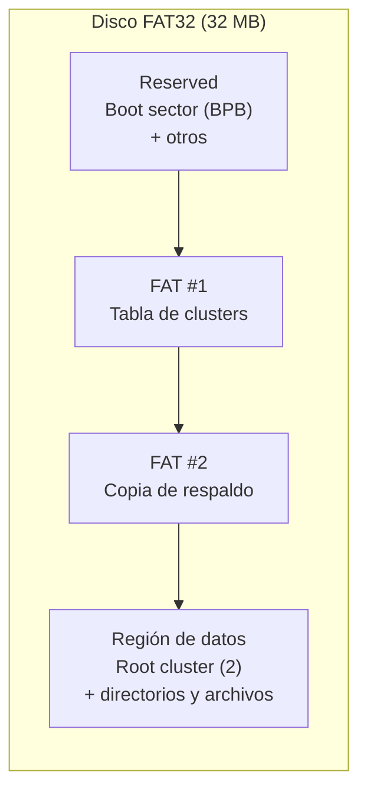
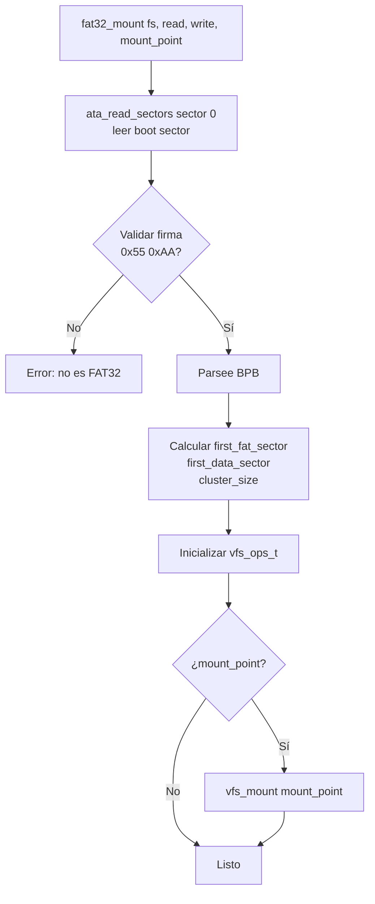
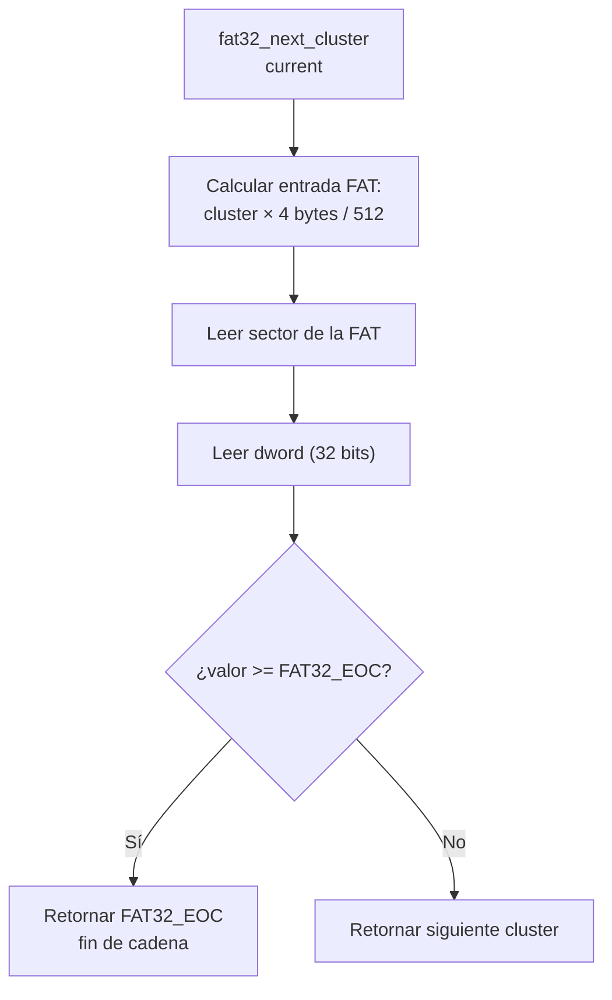

# Driver FAT32 (`include/fs/fat32.h` / `include/fs/filesystem.h` / `src/fs/fat32.c`)

## Qué es

El **FAT32** es un sistema de archivos ampliamente compatible que organiza los datos en clusters. El driver de DemOS parsee el **BPB (BIOS Parameter Block)**, sigue las **cadenas de clusters** de la tabla FAT, lee las **entradas de directorio 8.3** y expone estas operaciones al VFS.

## Estructura del disco FAT32



| Zona | Descripción |
|------|-------------|
| **Reserved** | Incluye el boot sector con el BPB (512 bytes) |
| **FAT #1** | Tabla FAT principal (mapa de clusters) |
| **FAT #2** | Copia de respaldo de la tabla FAT |
| **Región de datos** | Clusters de directorios y archivos (empieza en el cluster 2) |

## Boot sector (BPB)

```c
typedef struct {
    uint8_t boot_jump[3];            // Jump de arranque
    uint8_t oem_name[8];             // Nombre OEM
    uint16_t bytes_per_sector;       // Normalmente 512
    uint8_t sectors_per_cluster;     // Clusters (normalmente 1)
    uint16_t reserved_sectors;       // Sectores reservados
    uint8_t num_fats;                // Número de FATs (normalmente 2)
    uint16_t root_dir_entries;       // 0 en FAT32
    uint16_t total_sectors;          // 0 si usa total_sectors_large
    ...
    uint32_t total_sectors_large;    // Tamaño total del disco
    /* Extensión FAT32 */
    uint32_t sectors_per_fat_large;  // Sectores por FAT
    uint16_t flags;
    uint16_t fat_version;
    uint32_t root_cluster;           // Cluster de la raíz (normalmente 2)
    uint16_t fs_info_sector;
    uint16_t backup_boot_sector;
    ...
} __attribute__((packed)) boot_sector;
```

## Entrada de directorio 8.3

```c
typedef struct {
    uint8_t name[11];          // 8.3, mayúsculas, relleno con espacios
    uint8_t attributes;        // bit 0x10 = directorio, 0x0F = LFN
    uint8_t reserved;
    uint8_t creation_time_tenths;
    uint16_t creation_time;
    uint16_t creation_date;
    uint16_t last_access_date;
    uint16_t first_cluster_high;   // Parte alta del cluster inicial
    uint16_t last_write_time;
    uint16_t last_write_date;
    uint16_t first_cluster_low;    // Parte baja del cluster inicial
    uint32_t file_size;            // Tamaño en bytes
} __attribute__((packed)) fat32_dir_entry;
```

### Atributos

| Constante | Valor | Descripción |
|-----------|-------|-------------|
| `FAT32_ATTR_READ_ONLY` | 0x01 | Solo lectura |
| `FAT32_ATTR_HIDDEN` | 0x02 | Oculto |
| `FAT32_ATTR_SYSTEM` | 0x04 | Archivo de sistema |
| `FAT32_ATTR_VOLUME_ID` | 0x08 | Etiqueta de volumen |
| `FAT32_ATTR_DIRECTORY` | 0x10 | Directorio |
| `FAT32_ATTR_ARCHIVE` | 0x20 | Archivo |
| `FAT32_ATTR_LFN` | 0x0F | Long File Name (nombre largo) |

### Marcadores de la tabla FAT

| Constante | Valor | Descripción |
|-----------|-------|-------------|
| `FAT32_FREE` | `0x00000000` | Cluster libre |
| `FAT32_BAD_CLUSTER` | `0x0FFFFFF7` | Cluster dañado |
| `FAT32_EOC` | `0x0FFFFFF8` | Fin de cadena (End Of Chain) |
| `FAT32_EOC_MASK` | `0x0FFFFFFF` | Máscara de valor |
| `FAT32_FIRST_CLUSTER` | 2 | Primer cluster válido (raíz) |

## Instancia del filesystem — `fat32_fs_t`

```c
typedef struct {
    vfs_ops_t ops;              // Operaciones expuestas al VFS
    boot_sector bpb;            // Parámetros del boot sector
    uint32_t first_fat_sector;  // Sector inicial de la primera FAT
    uint32_t first_data_sector; // Sector inicial de la región de datos
    uint32_t root_cluster;      // Cluster de la raíz
    uint32_t total_data_sectors;
    uint32_t total_clusters;
    uint32_t cluster_size;      // Bytes por cluster

    fat32_read_sector_fn read_sector;    // Llamada al driver ATA
    fat32_write_sector_fn write_sector;
} fat32_fs_t;
```

## Funciones

| Función | Propósito |
|---------|-----------|
| `fat32_mount()` | Parsee el BPB, calcula la geometría y monta en el VFS |
| `fat32_read_cluster()` | Lee bytes de un cluster hacia un buffer |
| `fat32_next_cluster()` | Sigue la cadena de clusters de la tabla FAT |
| `fat32_lookup()` | Resuelve una ruta a un nodo del filesystem |

### `fat32_mount()`

1. Lee el **boot sector** (sector 0) con el driver ATA.
2. Valida la firma y parsee el **BPB**.
3. Calcula:
   - `first_fat_sector = reserved_sectors`
   - `first_data_sector = first_fat_sector + (num_fats * sectors_per_fat_large)`
   - `cluster_size = bytes_per_sector * sectors_per_cluster`
   - `root_cluster` (normalmente 2)
4. Inicializa las `vfs_ops_t` con implementaciones concretas.
5. Si `mount_point` no es NULL, llama a `vfs_mount()`.



### `fat32_read_cluster()`


### `fat32_next_cluster()` — seguir la cadena



## Layout del disco demos.img

El disco virtual `demos.img` (32 MB) que genera el Makefile contiene:

| Ruta | Tipo | Descripción |
|------|------|-------------|
| `/HELLO.TXT` | Archivo | Texto de prueba |
| `/FONDO.PNG` | Archivo | Fondo del escritorio (320x200) |
| `/docs/` | Directorio | Carpeta de documentación |
| `/docs/README.TXT` | Archivo | Documentación en disco |

### Cómo se crea (Makefile)

```makefile
$(DEMOS_IMG):
	dd if=/dev/zero of=$(DEMOS_IMG) bs=1M count=$(DISK_MEGS) status=none
	mkfs.fat -F 32 $(DEMOS_IMG) >/dev/null
	mmd -i $(DEMOS_IMG) ::/docs
	mcopy -i $(DEMOS_IMG) $(DISKDIR)/HELLO.TXT ::/HELLO.TXT
	mcopy -i $(DEMOS_IMG) $(DISKDIR)/FONDO.PNG ::/FONDO.PNG
	mcopy -i $(DEMOS_IMG) $(DISKDIR)/docs/README.TXT ::/docs/README.TXT
```

## Dependencias

| Módulo | Función usada |
|--------|---------------|
| `drivers/ata.h` | `ata_read_sectors()` (lectura de sectores) |
| `fs/vfs.h` | `vfs_ops_t`, `vfs_mount()` |
| `drivers/serial.h` | Mensajes de depuración por el puerto serie |
