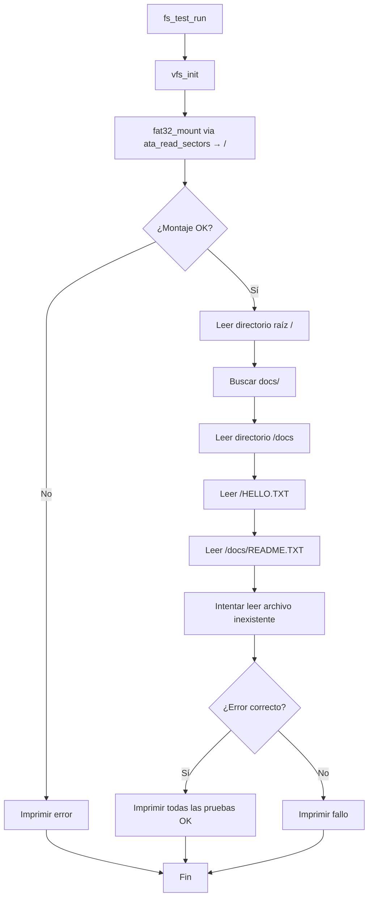

# Pruebas del filesystem (`include/fs/fstest.h` / `src/fs/fstest.c`)

## Qué es

`fs_test_run()` es una rutina de **autocomprobación** que se ejecuta durante el arranque del kernel (desde `kernel_main`). Monta el disco FAT32 vía el driver ATA con el VFS y valida:

1. El montaje del disco.
2. El listado de directorios.
3. La lectura de archivos de prueba.
4. El manejo de errores (archivo inexistente).

## Flujo de la prueba



## Comportamiento al arrancar

Al ejecutarse, `fs_test_run()` imprime por el puerto serie el resultado, como:

```
[FS] VFS initialized
[FS] Mounting FAT32 on '/'...
[FS] Mount OK
[FS] Listing root:
HELLO.TXT
FONDO.PNG
docs
[FS] Listing /docs:
README.TXT
[FS] Reading /HELLO.TXT: Hello from DemOS!
[FS] Reading /docs/README.TXT: ...
[FS] Testing error: opening /NOTEXIST.TXT -> expected error OK
[FS] All filesystem tests passed
```

Si algo falla, se imprime el punto exacto del error para facilitar la depuración.

## Relación con el resto del sistema


> **Nota**: `fs_test_run()` se ejecuta **antes** del cambio al modo gráfico, por lo que puede usar el puerto serie sin interferir con la pantalla.
