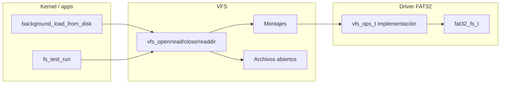
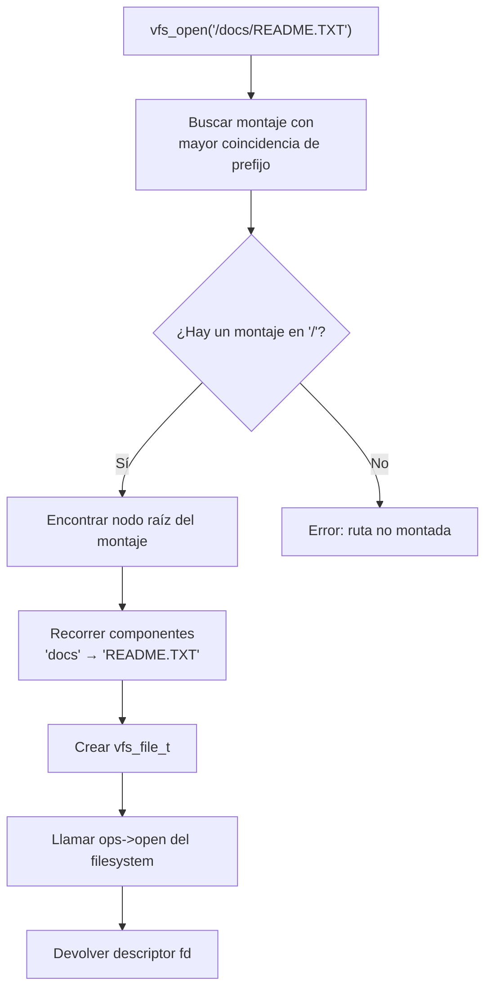

# VFS — Sistema de archivos virtual (`include/fs/vfs.h` / `src/fs/vfs.c`)

## Qué es

El **VFS (Virtual File System)** es una capa de abstracción que unifica el acceso a distintos filesystems. Permite que el kernel use rutas tipo `/dir/file` sin importar el formato real del disco (FAT32, ext2, etc.).

## Arquitectura



## Tipos principales

### `vfs_ops_t` — Operaciones que debe implementar cada filesystem

```c
typedef struct vfs_ops {
    int (*open)(void *fs, vfs_node_t *node, uint32_t mode, void **handle);
    int (*read)(void *fs, void *handle, void *buffer, uint32_t size);
    int (*seek)(void *fs, void *handle, int32_t offset, uint32_t whence);
    int (*close)(void *fs, void *handle);
    int (*readdir)(void *fs, vfs_node_t *node, uint32_t index, vfs_node_t *out);
} vfs_ops_t;
```

| Operación | Descripción |
|-----------|-------------|
| `open` | Abre un nodo para lectura/escritura según `mode`. Devuelve un handler |
| `read` | Lee hasta `size` bytes desde la posición actual |
| `seek` | Mueve la posición de lectura del handler |
| `close` | Cierra y libera el handler |
| `readdir` | Lee una entrada de directorio en `index` |

### `vfs_node_t` — Nodo abstracto

```c
struct vfs_node {
    vfs_node_t *parent;       // Nodo padre
    const char *name;         // Nombre
    uint32_t inode;           // Identificador interno del filesystem
    uint32_t size;            // Tamaño en bytes
    enum vfs_node_type type;  // FILE, DIRECTORY o UNKNOWN
    void *fs_data;            // Datos privados del filesystem
};
```

### `vfs_mount_t` — Punto de montaje

```c
typedef struct vfs_mount {
    bool used;                          // ¿En uso?
    char mount_point[VFS_MOUNT_NAME_MAX]; // Ruta donde se monta
    vfs_ops_t *ops;                     // Operaciones del filesystem
    void *fs;                           // Instancia concreta del filesystem
} vfs_mount_t;
```

### `vfs_file_t` — Archivo abierto

```c
typedef struct vfs_file {
    bool used;
    vfs_mount_t *mount;
    vfs_node_t node;
    void *handle;         // Handler devuelto por ops->open
    uint32_t position;    // Posición de lectura actual
} vfs_file_t;
```

## Constantes

| Constante | Valor | Descripción |
|-----------|-------|-------------|
| `VFS_MAX_PATH` | 256 | Longitud máxima de una ruta |
| `VFS_MAX_FILESYSTEMS` | 8 | Máximo de montajes |
| `VFS_MAX_OPEN_FILES` | 32 | Máximo de archivos abiertos |
| `VFS_NAME_MAX` | 64 | Longitud máxima de un nombre |

## API pública

| Función | Descripción |
|---------|-------------|
| `vfs_init()` | Inicializa las tablas de montajes y archivos abiertos |
| `vfs_mount(mount_point, ops, fs)` | Monta un filesystem en una ruta |
| `vfs_umount(mount_point)` | Desmonta un filesystem |
| `vfs_open(path, mode)` | Abre una ruta, devuelve un descriptor (>= 0) |
| `vfs_read(fd, buffer, size)` | Lee hasta `size` bytes de un descriptor |
| `vfs_seek(fd, offset, whence)` | Mueve la posición de lectura |
| `vfs_close(fd)` | Cierra un descriptor |
| `vfs_readdir(path, out, out_size)` | Lista el contenido de un directorio |

## Resolución de rutas

El VFS resuelve rutas tipo `/dir/file` usando la **coincidencia de prefijo más larga** (longest-prefix match) sobre la tabla de montajes:



## Montaje del filesystem FAT32

En `fs_test_run()` (llamada desde `kernel_main`), se monta el disco:

```c
fat32_mount(&fs, ata_read_sectors, NULL, "/");
```

Esto instala las operaciones `vfs_ops_t` del FAT32 en el punto de montaje `/`, de modo que rutas como `/FONDO.PNG` o `/docs/README.TXT` se resuelven contra el disco.

## Ejemplo de uso: leer un archivo

```c
int fd = vfs_open("/FONDO.PNG", 1);      // 1 = modo lectura
if (fd < 0) return;

uint32_t total = 0;
for (;;) {
    int n = vfs_read(fd, file_data + total, (uint32_t)(sizeof(file_data) - total));
    if (n <= 0) break;
    total += (uint32_t)n;
}
vfs_close(fd);
```
