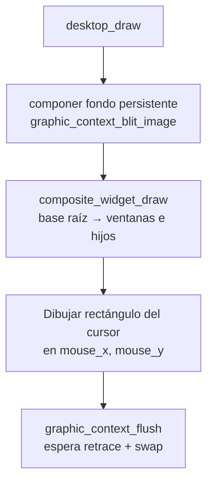
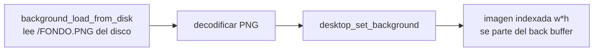
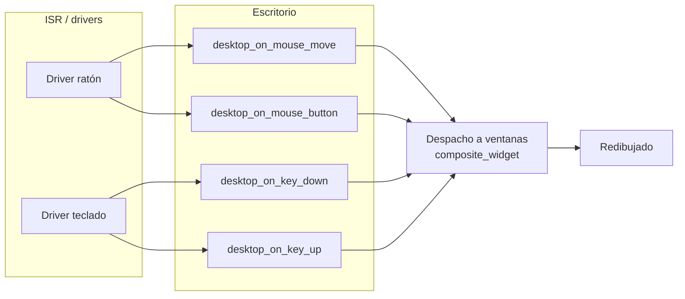

# Escritorio (`include/gui/desktop.h` / `src/gui/desktop.c`)

## Qué es

El `desktop_t` es el **widget compuesto raíz** a pantalla completa. Recibe los eventos del ratón y teclado (a través de callbacks registrados en los drivers) y los despacha a sus ventanas. También dibuja el cursor y el fondo persistente.

## `desktop_t`

```c
typedef struct {
    composite_widget_t base;   // Widget compuesto base

    int32_t mouse_x;           // Posición del cursor
    int32_t mouse_y;
    int32_t width;             // Dimensiones de pantalla
    int32_t height;

    const uint8_t *background; // Píxeles indexados 8 bits (fila a fila)
    uint32_t background_w;     // Fondo
    uint32_t background_h;
} desktop_t;
```

El escritorio guarda la posición del cursor, las dimensiones de pantalla y el **fondo persistente** que se compone detrás de las ventanas en cada frame.

## Inicialización

```c
void desktop_init(desktop_t *desktop, graphic_context_t *gc);
```

`desktop_init()` crea el escritorio a pantalla completa tomando la resolución del `graphic_context_t` (`gc`). Es el widget raíz (padre `NULL`).

## Dibujo del escritorio

```c
void desktop_draw(desktop_t *desktop, graphic_context_t *gc);
```



## Fondo del escritorio

```c
void desktop_set_background(desktop_t *desktop, const uint8_t *pixels, uint32_t w, uint32_t h);
```



El fondo se copia al back buffer en cada frame (via `graphic_context_blit_image`), detrás de las ventanas. Al ser persistente, no se sobrescribe con el flujo de dibujo. Se espera una imagen indexada de `w*h` bytes.

## Callbacks registrados en los drivers

El escritorio registra estos callbacks para recibir eventos de hardware:

| Callback | Firma | Propósito |
|----------|-------|-----------|
| `desktop_on_mouse_move` | `(int8_t x_offset, int8_t y_offset, void *data)` | Actualiza el cursor y despacha el movimiento |
| `desktop_on_mouse_button` | `(uint8_t button, int8_t x, int8_t y, bool pressed, void *data)` | Despacha un click a la ventana bajo el cursor |
| `desktop_on_key_down` | `(char c, void *data)` | Despacha tecla presionada al hijo enfocado |
| `desktop_on_key_up` | `(char c, void *data)` | Despacha tecla soltada al hijo enfocado |

En `main.c`, los callbacks se registran en los drivers del ratón y teclado, pasando `desktop` como `data`.

## Ciclo de eventos



## Dependencias

| Módulo | Uso |
|--------|-----|
| `gui/widget.h` | `composite_widget_t`, gestión de hijos/foco |
| `graphic_context.h` | Dibujo y blit del fondo |
| `types.h` | Tipos enteros |
