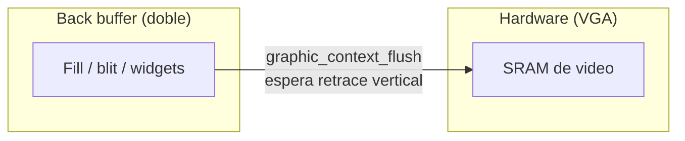
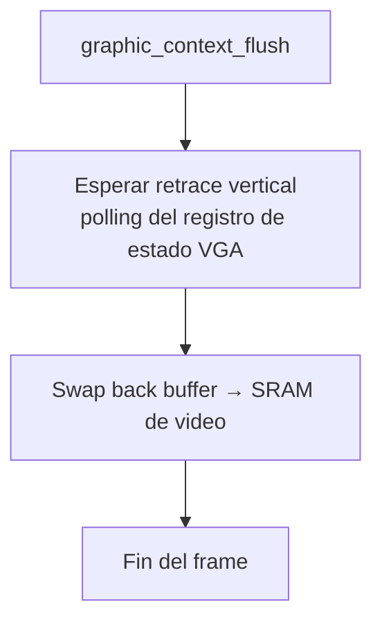

# Contexto gráfico (`include/graphic_context.h` / `src/graphic_context.c`)

## Qué es

El **contexto gráfico** (`graphic_context_t`) es una capa de abstracción sobre el driver VGA (modo 13h) que permite dibujar sin acoplarse al hardware. El sistema de widgets dibuja únicamente a través de esta interfaz.

## `graphic_context_t`

```c
typedef struct graphic_context {
    void (*put_pixel)(uint32_t x, uint32_t y, uint8_t color);
    void (*fill_rectangle)(uint32_t x, uint32_t y, uint32_t w, uint32_t h, uint8_t color);
} graphic_context_t;
```

El contexto encapsula el driver VGA mediante punteros a funciones de dibujo.

## API

| Función | Propósito |
|---------|-----------|
| `graphic_context_init(gc)` | Inicializa con los handlers por defecto del driver VGA |
| `graphic_context_set_current(gc)` | Establece el contexto activo |
| `graphic_context_get_current()` | Devuelve el contexto activo |
| `graphic_context_put_pixel(gc, x, y, color)` | Dibuja un píxel indexado de 8 bits |
| `graphic_context_fill_rectangle(gc, x, y, w, h, color)` | Rellena un rectángulo |
| `graphic_context_blit_image(gc, x, y, w, h, pixels)` | Copia una imagen indexada al back buffer |
| `graphic_context_flush(gc)` | Copia el back buffer completo a la pantalla |

## Flujo de dibujo de un frame



### `graphic_context_put_pixel` / `fill_rectangle`

Dibujan sobre el **back buffer** del driver VGA (memoria intermedia), no directamente sobre la SRAM de video.

### `graphic_context_blit_image`

```c
void graphic_context_blit_image(graphic_context_t *gc, uint32_t x, uint32_t y,
                                uint32_t w, uint32_t h, const uint8_t *pixels);
```

Copia una imagen indexada de 8 bits al back buffer en la posición indicada. **No recorta** contra el borde de pantalla (el caller garantiza que la imagen cabe). Se usa para dibujar el fondo persistente del escritorio de forma eficiente (un solo bucle de copia en lugar de un `put_pixel` por píxel).

### `graphic_context_flush`

```c
void graphic_context_flush(graphic_context_t *gc);
```

Copia el back buffer completo a la pantalla. Debe llamarse **al final de cada frame**, después de haber dibujado todo el contenido (widgets + cursor). **Espera al retrace vertical** para evitar el parpadeo y el tearing de imagen:



## Roles de carga de trabajo

| Operación | Frecuencia |
|-----------|------------|
| `blit_image` (fondo) | 1 vez por frame |
| `widget_draw` (ventanas) | 1 vez por frame |
| `fill_rectangle` (cursor) | 1 vez por frame |
| `flush` (swap) | 1 vez por frame |

## Dependencias

| Módulo | Uso |
|--------|-----|
| `drivers/vga.h` | Handlers de dibujo por defecto (put_pixel, fill_rectangle) |
| `types.h` | Tipos enteros |
