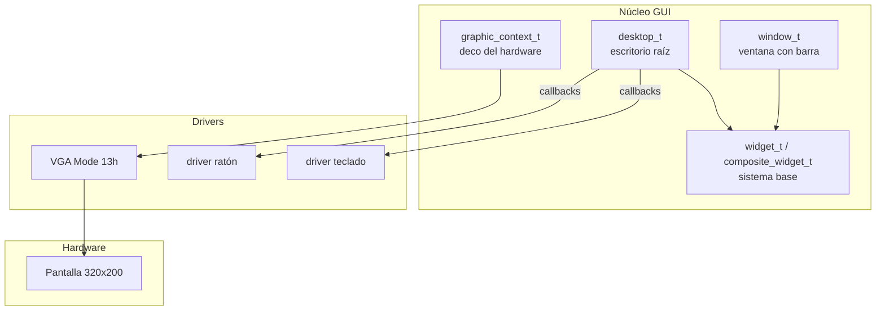
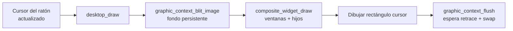
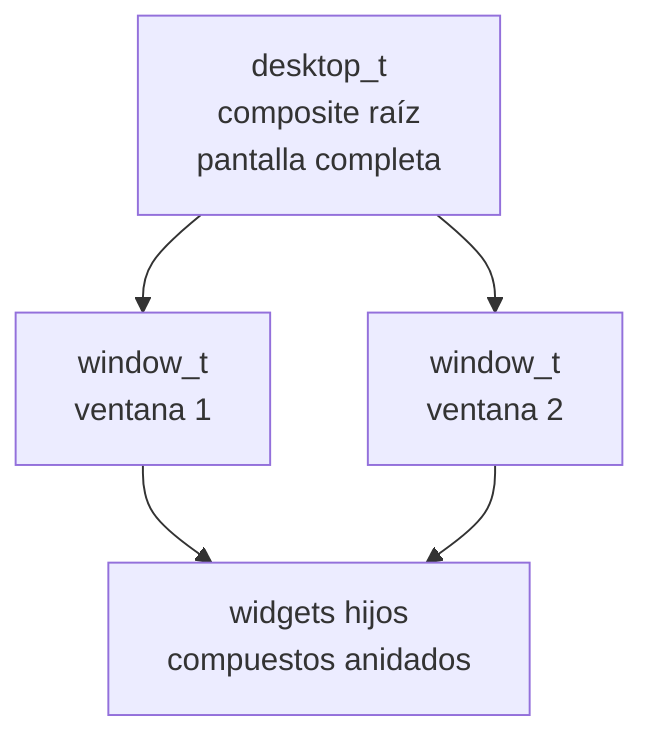

# Interfaz Gráfica (GUI)

DemOS incluye una pequeña interfaz gráfica con ventanas, escritorio y widgets, dibujada sobre el `graphic_context_t` (abstracción del driver VGA en modo 13h).

Cuando el kernel cambia a modo gráfico (320x200x8), se construye el escritorio y se cargan las ventanas, junto con los callbacks del ratón y teclado. El disco contiene un fondo (`/FONDO.PNG`) que se muestra detrás de las ventanas.

## Arquitectura

## Flujo de dibujo por frame

## Jerarquía de widgets

## En esta sección

- [Ventanas y escritorio (overview)](./overview/)
- [Sistema de widgets](./widget/)
- [Escritorio](./desktop/)
- [Ventanas](./window/)
- [Contexto gráfico](./graphic-context/)
