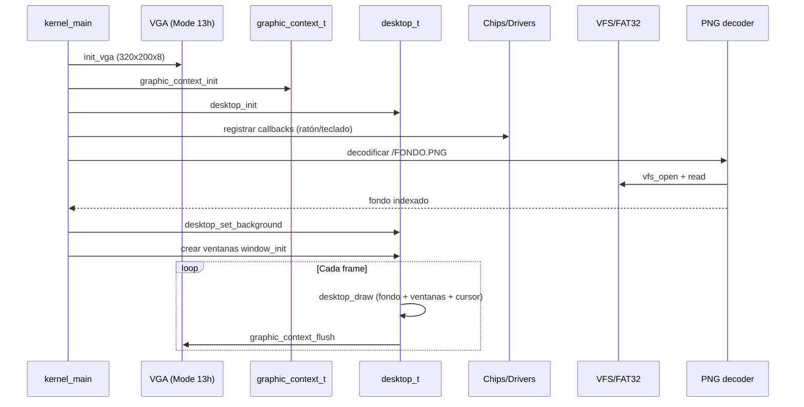
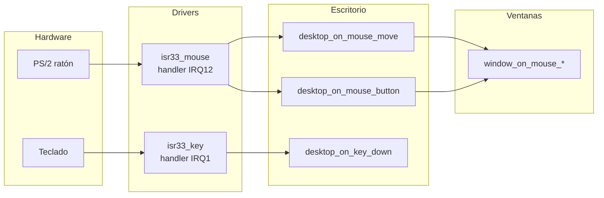

# GUI: ventanas y escritorio (visión general)

Esta página resume cómo se conectan el escritorio, las ventanas y los drivers para formar la interfaz gráfica de DemOS.

## Flujo de arranque de la GUI



## Eventos de entrada

Los callbacks que recibe el escritorio provienen de los ISRs del ratón y teclado. Una vez el desktop los recibe, los re-despacha a la ventana/gestor bajo el cursor o con el foco:



## Inicialización típica en `main.c`

```c
// (pseudocódigo)
graphic_context_init(&gc);
desktop_init(&desktop, &gc);
desktop_set_background(&desktop, fondo, 320, 200);

// Registrar callbacks del ratón y teclado...
chipset_register_irq(IRQ12, desktop_on_mouse_move, &desktop);
// ...

// Crear ventanas
window_init(&win1, &desktop.base, 20, 30, 200, 150, col, "Ventana 1");
composite_widget_add_child(&desktop.base, &win1.base);
```

## Documentos detallados

- [Sistema de widgets](./widget/) — base `widget_t` y componentes
- [Escritorio](./desktop/) — raíz a pantalla completa, fondo y cursor
- [Ventanas](./window/) — barras de título y arrastre
- [Contexto gráfico](./graphic-context/) — capa de dibujo sobre el VGA
