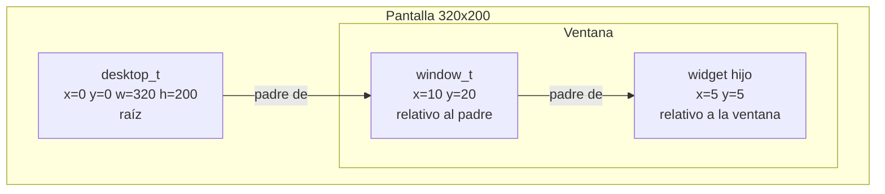
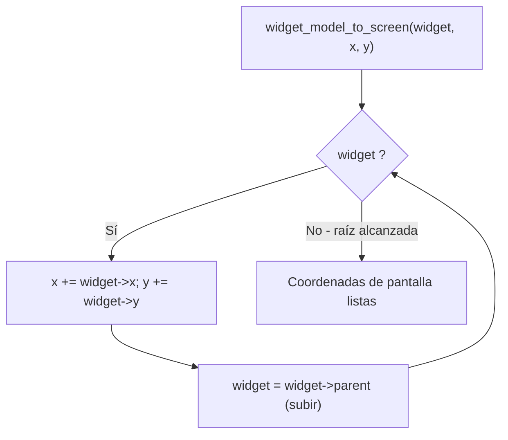
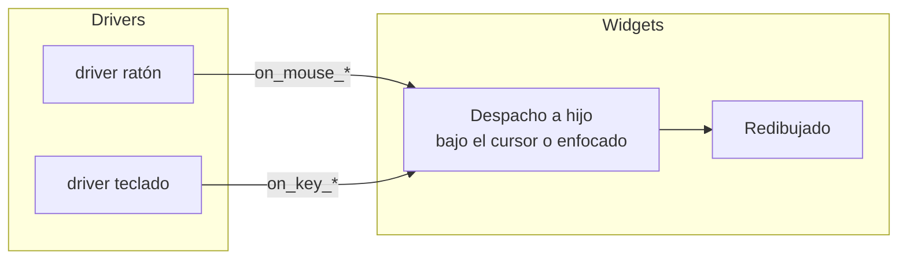

# Sistema de widgets (`include/gui/widget.h` / `src/gui/widget.c`)

## Qué es

El sistema de widgets define la base de la interfaz gráfica: un `widget_t` con posición, tamaño, color y eventos de entrada, y un `composite_widget_t` que contiene hijos y gestiona el foco.

## `widget_t` — Widget base

```c
#define WIDGET_CHILDREN_CAPACITY 100

typedef struct widget {
    struct widget *parent;
    int32_t x, y;    // Posición relativa al padre
    int32_t w, h;    // Dimensiones

    uint8_t color;   // Índice de color de paleta VGA (8 bits)
    bool focussable; // ¿Puede recibir el foco?

    // Métodos sobrecargables (function pointers)
    widget_get_focus_fn       get_focus;
    widget_model_to_screen_fn model_to_screen;
    widget_draw_fn            draw;
    widget_on_mouse_down_fn   on_mouse_down;
    widget_on_mouse_up_fn     on_mouse_up;
    widget_on_mouse_move_fn   on_mouse_move;
    widget_on_key_down_fn     on_key_down;
    widget_on_key_up_fn       on_key_up;
} widget_t;
```

Cada widget tiene un padre opcional, coordenadas **relativas al padre**, dimensiones y un color de paleta. Hereda su comportamiento mediante punteros a función (un mecanismo de polimorfismo en C).

## `composite_widget_t` — Widget compuesto

```c
typedef struct {
    widget_t base;                  // Hereda el widget base
    widget_t *children[WIDGET_CHILDREN_CAPACITY];
    int num_children;
    widget_t *focussed_child;       // Hijo con el foco actual
} composite_widget_t;
```

Un widget compuesto contiene hasta `WIDGET_CHILDREN_CAPACITY` (100) hijos, gestiona el dibujo, despacha los eventos y el foco hacia sus hijos.

## Jerarquía y coordenadas



Las coordenadas son **relativas al padre**. `widget_model_to_screen()` las convierte a coordenadas de pantalla recorriendo la cadena de padres.

## Coordenadas de modelo a pantalla



## Ciclo de eventos



## Funciones principales

### Inicialización

```c
void widget_init(widget_t *w, widget_t *parent, int32_t x, int32_t y,
                 int32_t w, int32_t h, uint8_t color);
void composite_widget_init(composite_widget_t *cw, widget_t *parent, int32_t x,
                           int32_t y, int32_t w, int32_t h, uint8_t color);
```

### Gestión de hijos

```c
// Agrega un hijo. Devuelve true si se agregó, false si la capacidad está llena.
bool composite_widget_add_child(composite_widget_t *cw, widget_t *child);
```

### Foco

```c
// Propaga la petición de foco hacia la raíz.
widget_t *widget_get_focus(widget_t *widget, widget_t *target);

// Establece el hijo enfocado y propaga.
widget_t *composite_widget_get_focus(composite_widget_t *cw, widget_t *widget);
```

### Draw y dispatch de eventos

```c
void composite_widget_draw(composite_widget_t *cw, graphic_context_t *gc);

void composite_widget_on_mouse_down(composite_widget_t *cw, int32_t x, int32_t y, uint8_t button);
void composite_widget_on_mouse_up(composite_widget_t *cw, int32_t x, int32_t y, uint8_t button);
void composite_widget_on_mouse_move(composite_widget_t *cw, int32_t oldx, int32_t oldy,
                                    int32_t newx, int32_t newy);
void composite_widget_on_key_down(composite_widget_t *cw, char c);
void composite_widget_on_key_up(composite_widget_t *cw, char c);
```

| Función | Comportamiento |
|---------|----------------|
| `composite_widget_draw` | Dibuja el compuesto y luego cada hijo |
| `composite_widget_on_mouse_down/up` | Despacha el click del botón a un hijo (el que contiene el punto) |
| `composite_widget_on_mouse_move` | Despacha el movimiento del ratón a un hijo |
| `composite_widget_on_key_down/up` | Envía la tecla al hijo enfocado |

## Dependencias

| Módulo | Uso |
|--------|-----|
| `graphic_context.h` | Dibujado sobre `graphic_context_t` |
| `types.h` | Tipos enteros (int32_t, bool, uint8_t) |
