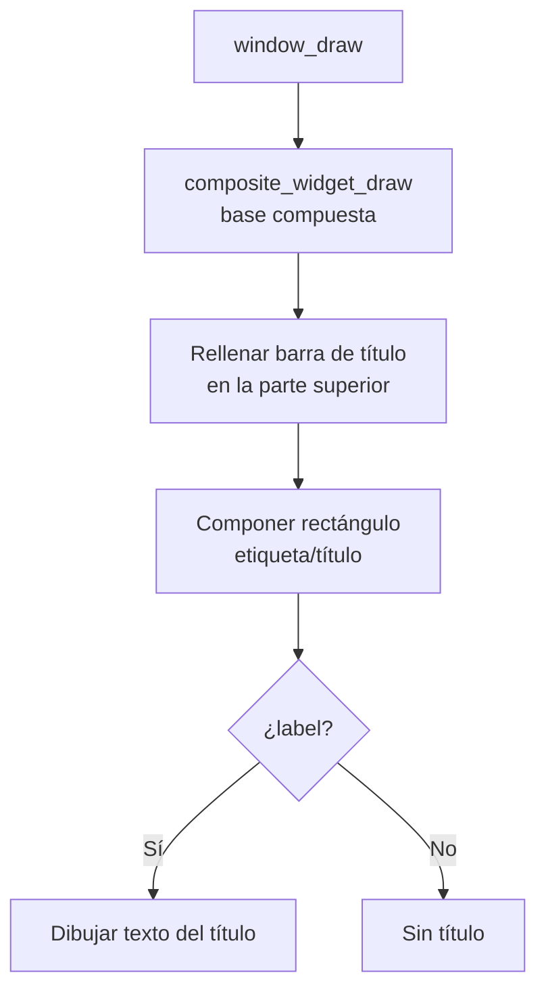
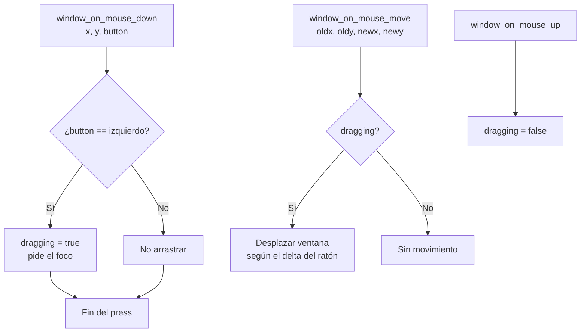

# Ventanas (`include/gui/window.h` / `src/gui/window.c`)

## Qué es

Una **ventana** (`window_t`) es un widget compuesto con barra de título que puede **arrastrarse** con el ratón y **recibir el foco**.

## `window_t`

```c
typedef struct {
    composite_widget_t base;   // Widget compuesto base

    char *label;               // Texto del título (NULL si no tiene)
    bool dragging;             // ¿Se está arrastrando?
} window_t;
```

## Inicialización

```c
void window_init(window_t *win, widget_t *parent, int32_t x, int32_t y,
                 int32_t w, int32_t h, uint8_t color, char *label);
```

| Parámetro | Descripción |
|-----------|-------------|
| `parent` | Widget padre (normalmente el desktop) |
| `x, y` | Posición (relativa al padre) |
| `w, h` | Tamaño |
| `color` | Color de fondo (índice de paleta VGA) |
| `label` | Título de la ventana (NULL si no tiene) |

Al inicializarse, `window_init()` configura la ventana como widget compuesto y asigna los handlers de dibujo y eventos.

## Dibujo con barra de título

```c
void window_draw(window_t *win, graphic_context_t *gc);
```



## Arrastre de ventanas

Una ventana se arrastra cuando se pulsa con el **botón izquierdo** en su barra de título:



### Funciones de arrastre

```c
// Inicia el arrastre si se pulsa con el botón izquierdo; pide el foco.
void window_on_mouse_down(window_t *win, int32_t x, int32_t y, uint8_t button);

// Termina el arrastre.
void window_on_mouse_up(window_t *win, int32_t x, int32_t y, uint8_t button);

// Mueve la ventana si está siendo arrastrada.
void window_on_mouse_move(window_t *win, int32_t oldx, int32_t oldy,
                          int32_t newx, int32_t newy);
```

## Dependencias

| Módulo | Uso |
|--------|-----|
| `gui/widget.h` | `composite_widget_t`, gestión de hijos/foco |
| `graphic_context.h` | Dibujo |
| `types.h` | Tipos enteros |
