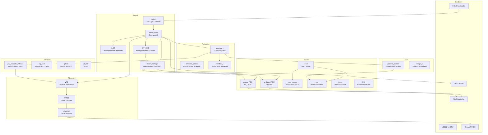

# DemOS

Sistema operativo minimalista desarrollado desde cero con fines educativos.

**DemOS** es un proyecto que implementa un kernel x86 de 32 bits en **C** y **ensamblador (NASM)**, arrancado mediante **GRUB** con la especificación **Multiboot**. Incluye gestión de memoria (GDT/IDT), controlador PIC 8259A, drivers PS/2 de teclado y mouse, puerto serie UART 16550, enumeración PCI, sistema de archivos VFS con soporte FAT32, decodificador PNG, y un entorno gráfico de ventanas con double-buffering.

## Arquitectura del sistema

## Cómo se organiza esta documentación

| Sección | Contenido |
|---------|-----------|
| [Introducción](/introduccion/) | Qué es DemOS, entorno de desarrollo, arquitectura general y flujo de ejecución |
| [Kernel](/kernel/) | Loader, linker script, kernel principal, GDT, interrupciones, administrador de drivers y librerías |
| [Drivers](/drivers/) | VGA (texto y gráfico), teclado, mouse, puerto serie, temporizador, ATA/IDE y controlador PCI |
| [Filesystem](/filesystem/) | Sistema de archivos VFS y driver FAT32 |
| [GUI](/gui/) | Sistema de widgets, escritorio, ventanas y contexto gráfico |
| [Utilidades](/utilidades/) | Decodificador PNG, glyphs grandes, splash y tipos base |
| [Build](/build/) | Sistema de compilación con Makefile y generación de ISO/disco |

## Empezar

Consulta la [introducción](/introduccion/) para conocer el proyecto, o dirígete directamente al [entorno y herramientas](/introduccion/entorno-setup/) para compilar y ejecutar DemOS.
