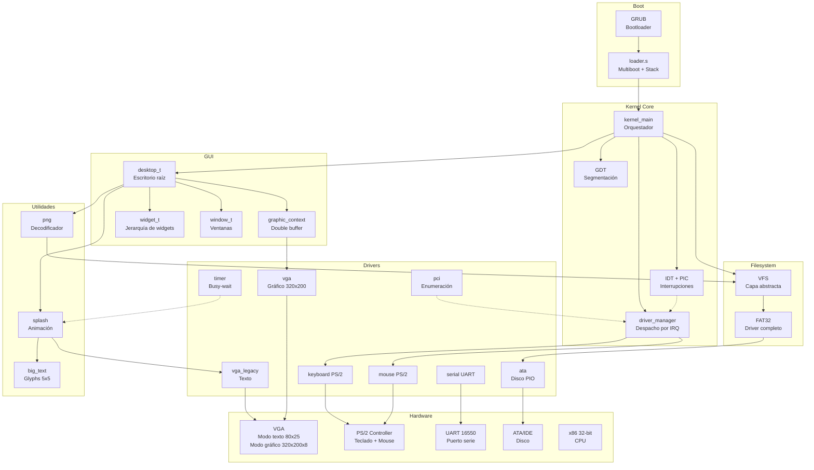
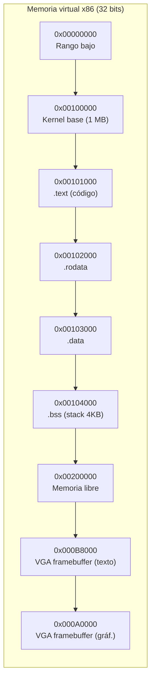
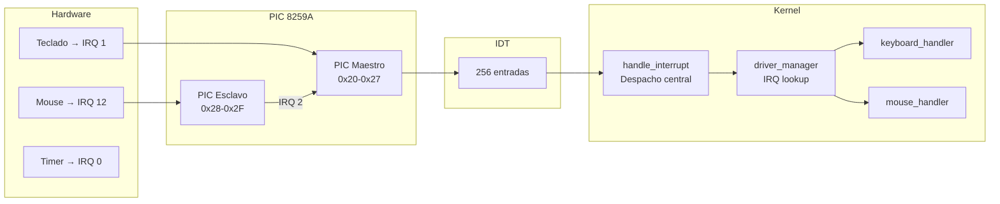
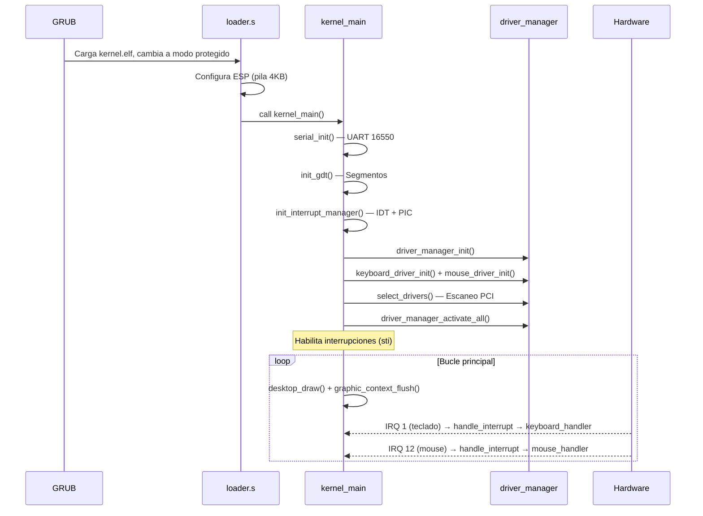

# Arquitectura general de DemOS

## Capas del sistema

## Modo de ejecución

DemOS opera en **32 bits (protegido)** desde el inicio. GRUB cambia el CPU a modo protegido antes de transferir el control al kernel.

### Modos de video soportados

| Modo | Resolución | Colores | Uso |
|------|-----------|---------|-----|
| **Texto 80x25** | 80 columnas × 25 filas | 16 colores (4 bits) | Arranque, splash, depuración |
| **Gráfico 320x200** | 320 × 200 píxeles | 256 colores (8 bits, paleta) | Escritorio, ventanas, PNG |

El kernel comienza en modo texto para el splash y luego cambia a modo gráfico para el escritorio.

## Espacio de direccionamiento

- **Kernel cargado en `0x00100000`** (1 MB) — especificación Multiboot
- **Pila del kernel**: 4 KB reservados en BSS (crece hacia abajo)
- **VGA framebuffer texto**: `0xB8000` — modo texto 80x25
- **VGA framebuffer gráfico**: segmento `0xA0000` — modo 320x200x8

## Sistema de interrupciones

## Flujo de datos

