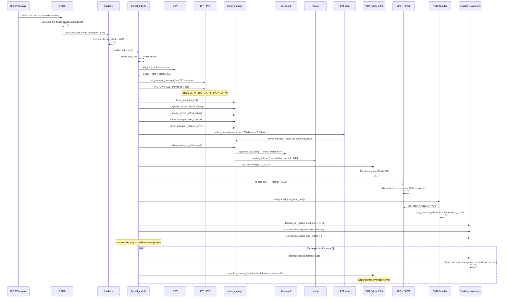
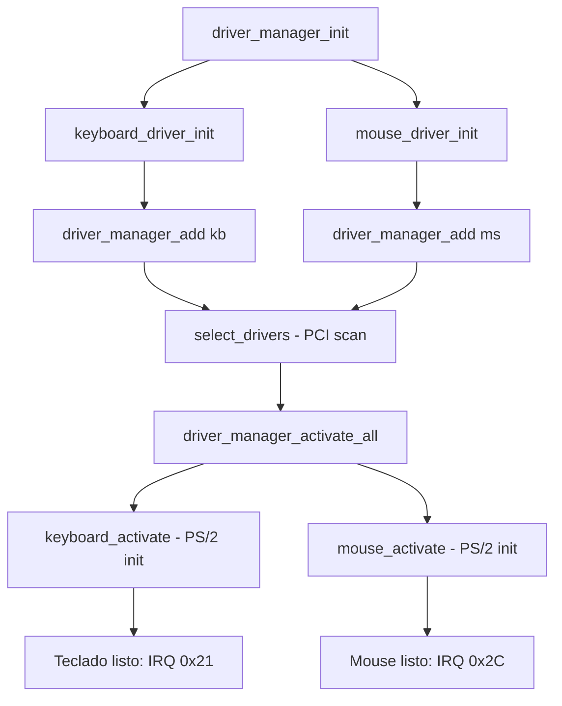
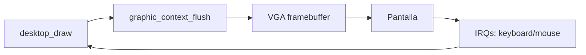

# Flujo de ejecución completo

Este documento traza el recorrido del código desde que el CPU se enciende hasta que el escritorio gráfico aparece en pantalla.

## Diagrama de secuencia completo



## Paso a paso detallado

### 1. Encendido / Reset

- CPU comienza ejecutando la BIOS en `0xFFFFFFF0`.
- POST (Power-On Self Test) y búsqueda de dispositivo booteable.

### 2. GRUB (bootloader)

- GRUB lee `grub.cfg`:
  ```cfg
  set timeout=5
  set default=0

  menuentry "DemOS" {
      multiboot /boot/kernel.elf
      boot
  }
  ```
- Localiza la cabecera Multiboot en `0x00100000`:
  - Magic: `0x1BADB002`, Flags: `0x0`, Checksum: `-(0x1BADB002)`.
- Cambia a **modo protegido 32 bits** y salta a `loader`.

### 3. asm/loader.s (Assembly)

```nasm
loader:
    mov esp, kernel_stack + KERNEL_STACK_SIZE  ; Pila al final del buffer de 4KB
    call kernel_main                           ; Salta a C
.hang:
    jmp .hang                                  ; Bucle infinito
```

### 4. src/kernel/main.c (C)

El punto de entrada en C orquesta toda la inicialización:

```c
int kernel_main()
{
    static global_descriptor_table gdt;

    serial_init(COM1_BASE_ADDRESS);            // UART para depuración
    init_gdt(&gdt);                            // Segmentos de memoria
    init_interrupt_manager(&gdt);              // IDT + PIC 8259A

    driver_manager_init(&global_driver_manager);

    // Modo gráfico: el escritorio recibe eventos
    graphic_context_init(&gc);
    desktop_init(&desktop, &gc);

    keyboard_driver_init(&kb_driver, desktop_on_key_down, &desktop);
    kb_driver.on_key_up = desktop_on_key_up;
    driver_manager_add(&global_driver_manager, &kb_driver.base);

    mouse_driver_init(&ms_driver, desktop_on_mouse_move, &desktop);
    ms_driver.on_mouse_button = desktop_on_mouse_button;
    driver_manager_add(&global_driver_manager, &ms_driver.base);

    select_drivers(&global_driver_manager);    // Escaneo PCI
    driver_manager_activate_all(&global_driver_manager);

    fs_test_run();                             // Montar FAT32

    vga_set_mode(320, 200, 8);                // Cambiar a modo gráfico
    vga_fill_rectangle(0, 0, 320, 200, 0x09);
    background_load_from_disk();               // Cargar PNG de fondo

    // Crear ventanas de ejemplo
    window_init(&win1, &desktop.base.base, 10, 10, 20, 20, 0x04, NULL);
    composite_widget_add_child(&desktop.base, &win1.base.base);
    window_init(&win2, &desktop.base.base, 40, 15, 30, 30, 0x02, NULL);
    composite_widget_add_child(&desktop.base, &win2.base.base);

    asm volatile("sti");                       // Habilitar interrupciones

    for (;;) {
        desktop_draw(&desktop, &gc);           // Dibujar todo
        graphic_context_flush(&gc);            // Copiar a pantalla
    }
    return 0;
}
```

### 5. Inicialización de drivers



Cada driver registra sus callbacks de interrupción. El `driver_manager` despacha IRQs al driver correcto usando `driver_manager_get_driver_for_irq()`.

### 6. Cambio a modo gráfico

Después de la inicialización de drivers, el kernel cambia al **modo gráfico 320x200x256** (Mode 13h) escribiendo los registros VGA apropiados. Luego carga el fondo PNG del disco FAT32 y crea las ventanas de ejemplo.

### 7. Bucle principal



El kernel queda en un bucle infinito que:
1. **Dibuja** el escritorio (fondo + ventanas + cursor) en el back buffer
2. **Hace flush** del back buffer al framebuffer VGA (esperando vsync)
3. **Recibe interrupciones** de teclado y mouse que actualizan el estado

## Resumen de tecnologías involucradas

| Tecnología | Uso en DemOS |
|------------|--------------|
| **x86 Assembly (NASM)** | Cabecera Multiboot, configuración de pila, interrupt stubs |
| **C (GCC -m32)** | Lógica del kernel, drivers, GUI, filesystem, PNG |
| **GRUB** | Gestor de arranque Multiboot |
| **VGA Text Mode (CP-437)** | Modo texto 80x25 para splash y depuración |
| **VGA Mode 13h** | Modo gráfico 320x200x256 para el escritorio |
| **GDT** | Segmentos de memoria en modo protegido |
| **IDT / PIC 8259A** | Manejo de interrupciones y excepciones |
| **Driver Manager** | Despacho centralizado de IRQs con polimorfismo |
| **PS/2 Controller** | Driver de teclado y mouse (scancodes/paquetes → pantalla) |
| **UART 16550** | Puerto serie para depuración |
| **PCI** | Enumeración de dispositivos y detección de hardware |
| **ATA/IDE PIO** | Lectura de sectores del disco para FAT32 |
| **VFS + FAT32** | Sistema de archivos virtual con soporte FAT32 |
| **PNG decoder** | Decodificador completo desde cero (DEFLATE + filtros) |
| **GUI widgets** | Sistema de ventanas con double-buffering y vsync |
| **Framebuffer (0xB8000/0xA0000)** | Escritura directa en memoria de video |
| **Linker Script** | Organización de secciones en memoria |
| **Makefile** | Automatización de compilación + disco virtual |
| **QEMU** | Emulación para pruebas |
| **Multiboot spec** | Estándar de interfaz kernel-bootloader |
