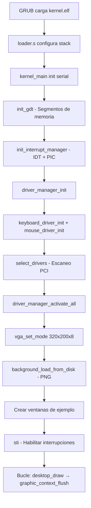

# Introducción a DemOS

**DemOS** es un sistema operativo minimalista desarrollado desde cero con fines educativos. Implementa un kernel x86 de 32 bits con un entorno gráfico de ventanas, soporte de filesystem FAT32 y drivers para dispositivos de entrada y salida.

## Qué hace DemOS

Al iniciarse, DemOS ejecuta la siguiente secuencia:



## Componentes principales

| Componente | Archivo | Descripción |
|-----------|---------|-------------|
| **Loader** | `asm/loader.s` | Punto de entrada en ensamblador, cabecera Multiboot, configuración de pila |
| **Kernel** | `src/kernel/main.c` | Orquestador que inicializa todos los subsistemas |
| **GDT** | `src/kernel/gdt.c` | Tabla de Descriptores Globales (segmentos de código y datos) |
| **IDT/PIC** | `src/kernel/interrupts.c` | Tabla de Descriptores de Interrupciones y controlador PIC 8259A |
| **Driver Manager** | `src/drivers/driver.c` | Administrador centralizado de drivers con despacho por IRQ |
| **Teclado** | `src/drivers/keyboard.c` | Driver PS/2 con traducción QWERTY Latam y callbacks |
| **Mouse** | `src/drivers/mouse.c` | Driver PS/2 con decodificación de paquetes de 3 bytes |
| **Serie** | `src/drivers/serial.c` | Puerto UART 16550 para depuración |
| **VGA texto** | `src/drivers/vga_legacy.c` | Framebuffer en modo texto 80x25 (0xB8000) |
| **VGA gráfico** | `src/drivers/vga.c` | Modo gráfico 320x200x256 colores (Mode 13h) |
| **PCI** | `src/kernel/pci.c` | Enumeración del bus PCI y detección de dispositivos |
| **Timer** | `src/drivers/timer.c` | Espera activa (busy-wait) para delays |
| **ATA** | `src/drivers/ata.c` | Driver de disco ATA/IDE en modo PIO |
| **VFS** | `src/fs/vfs.c` | Sistema de archivos virtual con tabla de montajes |
| **FAT32** | `src/fs/fat32.c` | Driver de sistema de archivos FAT32 |
| **GUI** | `src/gui/` | Sistema de widgets, escritorio y ventanas |
| **PNG** | `src/util/png.c` | Decodificador PNG completo desde cero |
| **Big Text** | `src/util/big_text.c` | Glyphs 5x5 y renderizado de caracteres grandes |
| **Splash** | `src/util/splash.c` | Animación de bienvenida |

## Estructura del proyecto

```
DemOS/
├── asm/
│   ├── loader.s              # Arranque (Multiboot + stack)
│   └── interruptstubs.s      # Stubs en ensamblador para interrupciones
├── src/
│   ├── kernel/
│   │   ├── main.c            # Entry point del kernel
│   │   ├── gdt.c             # GDT, descriptores de segmento
│   │   ├── interrupts.c      # IDT, PIC 8259A, despacho de interrupciones
│   │   └── pci.c             # Enumeración PCI, detección de dispositivos
│   ├── drivers/
│   │   ├── driver.c          # Administrador centralizado de drivers
│   │   ├── keyboard.c        # Driver de teclado PS/2
│   │   ├── mouse.c           # Driver de mouse PS/2
│   │   ├── serial.c          # Puerto serie (UART 16550)
│   │   ├── timer.c           # delay() busy-wait
│   │   ├── vga.c             # Modo gráfico 320x200x8
│   │   ├── vga_legacy.c      # Modo texto 80x25
│   │   └── ata.c             # Driver de disco ATA/IDE PIO
│   ├── fs/
│   │   ├── vfs.c             # Sistema de archivos virtual
│   │   ├── fat32.c           # Driver FAT32
│   │   └── fstest.c          # Pruebas del filesystem
│   ├── gui/
│   │   ├── widget.c          # Sistema base de widgets
│   │   ├── desktop.c         # Escritorio gráfico (raíz)
│   │   ├── window.c          # Ventanas con barra de título
│   │   └── graphic_context.c # Double buffer y flush a VGA
│   └── util/
│       ├── big_text.c        # Glyphs, draw_box, draw_big_char
│       ├── splash.c          # Animación de bienvenida
│       ├── png.c             # Decodificador PNG completo
│       └── util_lib.c        # strlen
├── include/
│   ├── types.h               # Tipos enteros exactos + bool
│   ├── asm.h                 # Instrucciones in/out (inline asm)
│   ├── graphic_context.h     # Interfaz de dibujo abstracta
│   ├── kernel/
│   │   ├── gdt.h             # Tabla de Descriptores Globales
│   │   ├── interrupts.h      # IDT y manejadores de interrupción
│   │   └── pci.h             # Enumeración y configuración del bus PCI
│   ├── drivers/
│   │   ├── driver.h          # Interfaz base de drivers + manager
│   │   ├── keyboard.h        # Driver de teclado PS/2
│   │   ├── mouse.h           # Driver de mouse PS/2
│   │   ├── serial.h          # Puerto serie (UART 16550)
│   │   ├── timer.h           # delay()
│   │   ├── vga.h             # Modo gráfico VGA
│   │   ├── vga_legacy.h      # Modo texto VGA
│   │   └── ata.h             # Driver ATA/IDE
│   ├── fs/
│   │   ├── vfs.h             # Sistema de archivos virtual
│   │   ├── fat32.h           # Driver FAT32
│   │   ├── filesystem.h      # Estructuras on-disk FAT32
│   │   └── fstest.h          # Pruebas
│   ├── gui/
│   │   ├── widget.h          # Sistema de widgets
│   │   ├── desktop.h         # Escritorio
│   │   └── window.h          # Ventanas
│   └── util/
│       ├── big_text.h        # Glyphs, draw_box, draw_big_char
│       ├── splash.h          # animate_splash()
│       ├── png.h             # Decodificador PNG
│       └── util_lib.h        # strlen
├── disk/
│   ├── HELLO.TXT             # Archivo de prueba
│   ├── FONDO.PNG             # Fondo del escritorio
│   └── docs/
│       └── README.TXT        # Documentación en disco
├── link.ld                   # Script de enlace
├── Makefile                  # Compilación
├── grub.cfg                  # Configuración GRUB
├── build/                    # Objetos compilados
├── iso/                      # Imagen ISO
├── DemOS.iso                 # ISO booteable final
└── demos.img                 # Disco virtual FAT32
```
