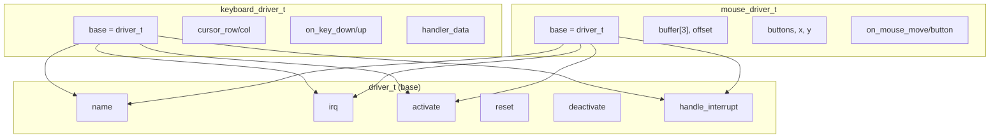
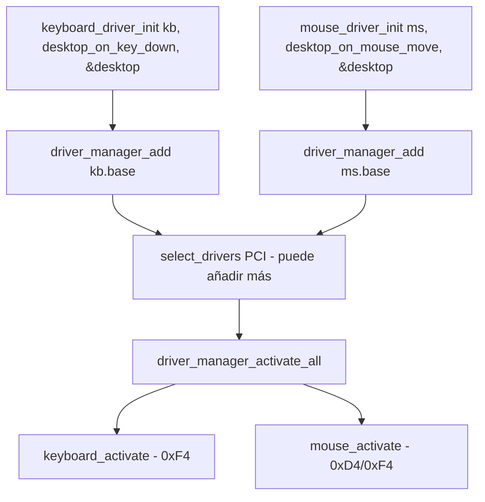
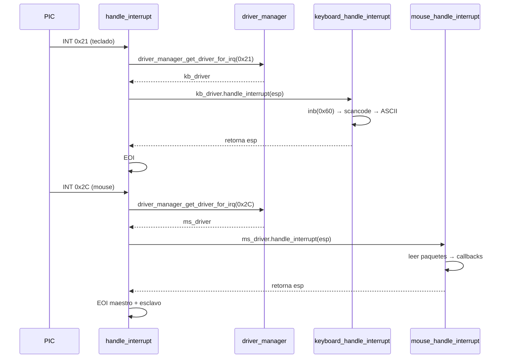

# Administrador de drivers (`include/drivers/driver.h` / `src/drivers/driver.c`)

## Qué es

El **administrador de drivers** es el componente central que gestiona todos los controladores de dispositivos del sistema. Proporciona un mecanismo **genérico y polimórfico** para registrar, activar y despachar interrupciones a los drivers, en lugar de hardcodear cada IRQ en el kernel.

## Interfaz base — `driver_t`

Cada driver concreto (teclado, mouse, etc.) contiene una estructura `driver_t` e implementa punteros a funciones:

```c
typedef struct driver {
    const char *name;              // Nombre del driver (p.ej. "keyboard")
    uint8_t irq;                   // Número de IRQ que maneja (0 = sin IRQ)

    void (*activate)(struct driver *self);              // Activar el dispositivo
    int (*reset)(struct driver *self);                  // Resetear el dispositivo
    void (*deactivate)(struct driver *self);            // Desactivar el dispositivo
    uint32_t (*handle_interrupt)(struct driver *self, uint32_t esp);  // Manejar IRQ
} driver_t;
```

### Los punteros a función como "métodos virtuales"



Esto simula **herencia y polimorfismo** en C: cada driver define su propia implementación de `handle_interrupt`, `activate`, etc., pero el manager los trata de forma uniforme.

## Tipos de callback

```c
typedef void (*on_key_down_fn)(char c, void *data);
typedef void (*on_key_up_fn)(char c, void *data);
typedef void (*on_mouse_move_fn)(int8_t x_offset, int8_t y_offset, void *data);
typedef void (*on_mouse_button_fn)(uint8_t button, int8_t x, int8_t y, bool pressed, void *data);
```

El parámetro `@data` permite pasar contexto (por ejemplo, el puntero al `desktop_t`) para que los eventos se despachen al destino correcto.

## Administrador — `driver_manager_t`

```c
#define MAX_DRIVERS 256

typedef struct {
    driver_t *drivers[MAX_DRIVERS];   // Arreglo de punteros a drivers
    uint32_t num_drivers;              // Cantidad registrada
} driver_manager_t;
```

### Instancia global

```c
extern driver_manager_t global_driver_manager;  // Definida en interrupts.c
```

La instancia global es **compartida** entre `main.c` (que la llena) e `interrupts.c` (que la consulta para despachar IRQs).

## Funciones del manager

| Función | Propósito |
|---------|-----------|
| `driver_manager_init()` | Inicializa el administrador (num_drivers = 0) |
| `driver_manager_add()` | Registra un driver en el arreglo |
| `driver_manager_activate_all()` | Invoca `activate()` en cada driver registrado |
| `driver_manager_get_driver_for_irq()` | Busca el driver que maneja un IRQ dado |

### `driver_manager_get_driver_for_irq()`

```c
driver_t *driver_manager_get_driver_for_irq(driver_manager_t *manager, uint8_t irq)
{
    for (uint32_t i = 0; i < manager->num_drivers; i++) {
        if (manager->drivers[i]->irq == irq) {
            return manager->drivers[i];
        }
    }
    return NULL;
}
```

## Flujo de registro y despacho

### Registro



```c
keyboard_driver_init(&kb_driver, desktop_on_key_down, &desktop);
driver_manager_add(&global_driver_manager, &kb_driver.base);

mouse_driver_init(&ms_driver, desktop_on_mouse_move, &desktop);
driver_manager_add(&global_driver_manager, &ms_driver.base);
```

### Despacho de interrupciones

Cuando llega una IRQ, `handle_interrupt()` consulta al manager:



## Ventajas frente al enfoque anterior

| Aspecto | Enfoque anterior (hardcoded) | Con driver_manager |
|---------|------------------------------|--------------------|
| Puntos de extensión | Modificar `handle_interrupt()` para cada IRQ | Solo registrar un driver nuevo |
| Acoplamiento | Kernel conoce cada driver | Kernel solo conoce la interfaz `driver_t` |
| Despacho | `if (num == 0x21) ... else if (num == 0x2C)` | Búsqueda en tabla por IRQ |
| Callbacks | Funciones globales | Callbacks por driver con contexto (`data`) |

## Dependencias

| Módulo | Función usada |
|--------|---------------|
| `types.h` | Tipos enteros, `bool` |
| `util/util_lib.h` | (inclusive base) |
| `kernel/interrupts.c` | Usa el manager para el despacho |
| `kernel/main.c` | Registra drivers en el manager |
