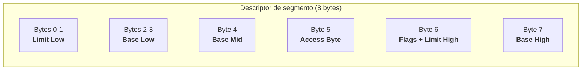
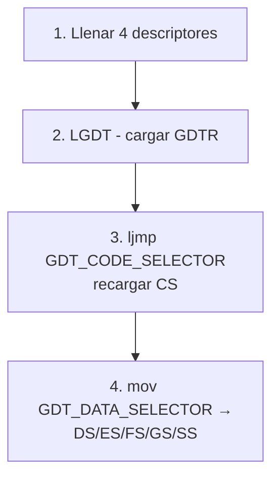
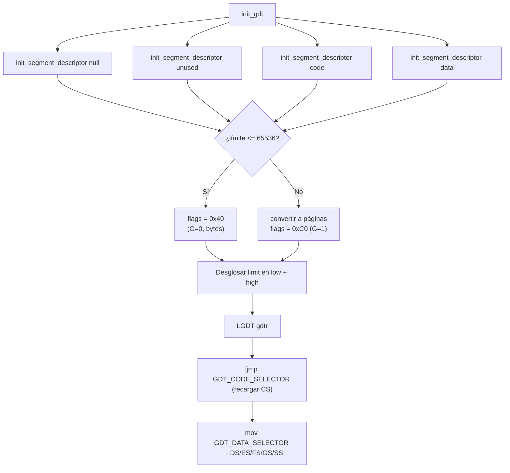

# Tabla de Descriptores Globales — GDT (`include/kernel/gdt.h` / `src/kernel/gdt.c`)

## Qué es la GDT

La **GDT (Global Descriptor Table)** es una tabla de 4 entradas que define los **segmentos de memoria** en modo protegido x86. Cada entrada (descriptor) describe un segmento: su dirección base, límite (tamaño máximo) y atributos de acceso (lectura, escritura, ejecución, nivel de privilegio).

Sin una GDT, el CPU no puede acceder a la memoria en modo protegido porque no tiene forma de validar las direcciones.

## Por qué necesita DemOS una GDT

Aunque GRUB ya configura un modo protegido básico, DemOS crea su propia GDT para:

1. **Control total** sobre los segmentos de memoria
2. **Soporte de interrupciones** (la IDT requiere un selector de segmento de código válido en la GDT)
3. **Buenas prácticas** de desarrollo de kernels

## Estructura de un descriptor de segmento

Cada descriptor de la GDT es una estructura de **8 bytes** (64 bits):



### Campo `base` (32 bits)

Dirección de inicio del segmento en memoria física. En DemOS, los segmentos de código y datos usan base `0x00000000` y límite `0xFFFFFFFF` (todo el espacio de 4 GB).

### Campo `limit` (20 bits)

Tamaño máximo del segmento. Se codifica en 20 bits con un factor de granularidad:

| Granularidad | Cálculo del límite |
|-------------|---------------------|
| Byte (G=0) | Límite = valor directo (hasta 1 MB) |
| Página (G=1) | Límite = valor × 4096 (hasta 4 GB) |

### Campo `access` (8 bits)

Define los permisos y tipo del segmento:

| Bit | Nombre | Significado |
|-----|--------|-------------|
| 7 | P (Present) | 1 = segmento presente en memoria |
| 6-5 | DPL | Nivel de privilegio (0 = kernel, 3 = usuario) |
| 4 | S | 0 = segmento de sistema, 1 = código/datos |
| 3 | E | 1 = segmento de código, 0 = segmento de datos |
| 2 | DC | Código: conformante. Datos: direction |
| 1 | RW | Código: legible. Datos: escribible |
| 0 | Accessed | CPU lo pone a 1 cuando accede al segmento |

### Valores de `access` usados en DemOS

| Valor | Binario | Tipo |
|-------|---------|------|
| `0x9A` | `10011010` | Código: presente, DPL=0, ejecutable, legible |
| `0x92` | `10010010` | Datos: presente, DPL=0, escribible |

### Campo `flags` (4 bits)

| Bit | Nombre | Significado |
|-----|--------|-------------|
| 3 | G | Granularidad: 0=bytes, 1=páginas de 4KB |
| 2 | D/B | 0=16 bits, 1=32 bits |
| 1 | L | 0=modo legado, 1=modo long (64 bits, no usado) |
| 0 | AVL | Reservado para uso del SO |

En DemOS: `G=1, D=1` → granularidad de 4KB, modo 32 bits.

## Estructura de la GDT de DemOS

```c
typedef struct __attribute__((packed)) {
    SegmentDescriptor null_segment_selector;      // Entrada 0: Nula (obligatoria)
    SegmentDescriptor unused_segment_selector;    // Entrada 1: No usada
    SegmentDescriptor code_segment_selector;      // Entrada 2: Código (0x10)
    SegmentDescriptor data_segment_selector;      // Entrada 3: Datos (0x18)
} global_descriptor_table;
```

| Entrada | Selector | Tipo | Base | Límite | Access |
|---------|----------|------|------|--------|--------|
| 0 | `0x00` | Nula | 0 | 0 | 0x00 |
| 1 | `0x08` | Sin usar | 0 | 0 | 0x00 |
| 2 | `0x10` | Código | `0x00000000` | `0xFFFFFFFF` | `0x9A` |
| 3 | `0x18` | Datos | `0x00000000` | `0xFFFFFFFF` | `0x92` |

### Selectores de segmento

Los selectores son los offsets de cada descriptor dentro de la GDT:

```c
#define GDT_CODE_SELECTOR 0x10   // Entrada 2 (offset 16 bytes)
#define GDT_DATA_SELECTOR 0x18   // Entrada 3 (offset 24 bytes)
```

Estos valores se cargan en los registros de segmento del CPU (`CS`, `DS`, `ES`, `FS`, `GS`, `SS`).

## src/kernel/gdt.c — Implementación

### `init_gdt()` — Inicialización completa

```c
void init_gdt(global_descriptor_table *gdt)
{
    init_segment_descriptor(&gdt->null_segment_selector, 0, 0, 0);
    init_segment_descriptor(&gdt->unused_segment_selector, 0, 0, 0);
    init_segment_descriptor(&gdt->code_segment_selector, 0, 0xFFFFFFFFU, 0x9A);
    init_segment_descriptor(&gdt->data_segment_selector, 0, 0xFFFFFFFFU, 0x92);

    serial_write_string(COM1_BASE_ADDRESS, "[GDT] Descriptors filled\n", 25);

    gdtr_t gdtr;
    gdtr.base = (uint32_t)gdt;
    gdtr.limit = sizeof(global_descriptor_table) - 1;

    __asm__ volatile("lgdt %0" : : "m"(gdtr));

    serial_write_string(COM1_BASE_ADDRESS, "[GDT] GDTR loaded\n", 18);

    /* far jump para recargar CS con el nuevo code segment descriptor */
    __asm__ volatile("ljmp %0, $1f\n"
                     "1:\n"
                     :
                     : "i"(GDT_CODE_SELECTOR));

    serial_write_string(COM1_BASE_ADDRESS, "[GDT] CS reloaded\n", 18);

    /* recargar data segment registers */
    __asm__ volatile("mov %0, %%ds\n"
                     "mov %0, %%es\n"
                     "mov %0, %%fs\n"
                     "mov %0, %%gs\n"
                     "mov %0, %%ss\n"
                     :
                     : "r"((uint16_t)GDT_DATA_SELECTOR));

    serial_write_string(COM1_BASE_ADDRESS, "[GDT] DS/ES/FS/GS/SS reloaded\n", 30);
    serial_write_string(COM1_BASE_ADDRESS, "[GDT] Ready\n", 12);
}
```

**Pasos críticos:**



| Paso | Qué hace | Por qué es necesario |
|------|----------|----------------------|
| 1. Llenar descriptores | Define 4 segmentos | La GDT debe estar poblada antes de usarla |
| 2. LGDT | Carga la GDTR (Dirección + Tamaño) | El CPU necesita saber dónde está la GDT |
| 3. Far jump (`ljmp`) | Recarga el registro CS | `CS` conserva su valor anterior; solo un `ljmp` lo actualiza |
| 4. Recargar DS/ES/etc | Actualiza registros de datos | Deben apuntar al nuevo selector de datos |

> **Nota**: Cada paso emite un mensaje `[GDT] ...` por el puerto serie para depuración.

### `init_segment_descriptor()` — Configuración individual

```c
void init_segment_descriptor(SegmentDescriptor *sd, uint32_t base, uint32_t limit, uint8_t type)
{
    if (limit <= 65536) {
        sd->flags_and_limit_high = 0x40;        // G=0 (bytes), D=1 (32 bits)
    } else {
        if ((limit & 0xFFF) != 0xFFF)
            limit = (limit >> 12) - 1;
        else
            limit = limit >> 12;
        sd->flags_and_limit_high = 0xC0;        // G=1 (páginas), D=1 (32 bits)
    }
    sd->limit_low = limit & 0xFFFF;
    sd->flags_and_limit_high |= (limit >> 16) & 0xF;
    sd->base_low = base & 0xFFFF;
    sd->base_mid = (base >> 16) & 0xFF;
    sd->base_high = (base >> 24) & 0xFF;
    sd->access_byte = type;
}
```

**Lógica de granularidad:**

```
Si límite <= 65536:
    Usar granularidad de BYTE (G=0)
    Límite directo en los 20 bits

Si límite > 65536:
    Convertir a páginas de 4KB (dividir por 4096)
    Si (límite & 0xFFF) != 0xFFF:
        Restar 1 para cubrir los bytes parciales
    Activar G=1
```

### Funciones auxiliares

| Función | Propósito |
|---------|-----------|
| `segment_descriptor_get_base()` | Extrae la base de 32 bits desde un descriptor |
| `segment_descriptor_get_limit()` | Extrae el límite de 20 bits, ajustando por granularidad |
| `gdt_get_code_selector()` | Calcula el offset del descriptor de código en la GDT |
| `gdt_get_data_selector()` | Calcula el offset del descriptor de datos en la GDT |

```c
uint32_t segment_descriptor_get_limit(SegmentDescriptor *sd)
{
    uint32_t limit = ((uint32_t)(sd->flags_and_limit_high & 0xF) << 16) | sd->limit_low;

    if ((sd->flags_and_limit_high & 0xC0) == 0xC0) {
        limit = (limit << 12) | 0xFFF;   // Desgranular: páginas → bytes
    }

    return limit;
}
```

## GDTR — Registro de Descriptor Global

```c
typedef struct __attribute__((packed)) {
    uint16_t limit;
    uint32_t base;
} gdtr_t;
```

El registro GDTR tiene 48 bits: 16 bits de tamaño + 32 bits de dirección. La instrucción `LGDT` carga este registro.

## Flujo de inicialización


