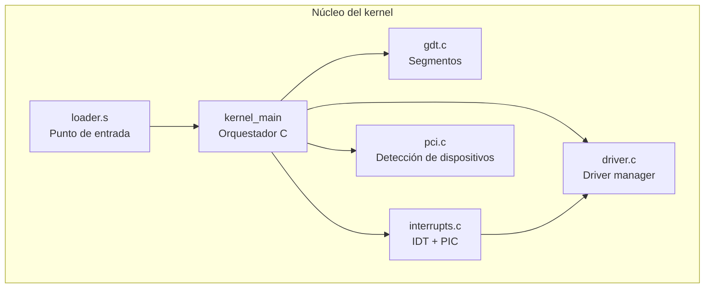

# Kernel

El núcleo de DemOS: desde el punto de entrada en ensamblador hasta el arranque de C, la gestión de memoria con la GDT, el sistema de interrupciones (IDT/PIC), el administrador centralizado de drivers y las librerías propias del sistema.

## Resumen

## En esta sección

- [Loader en ensamblador](./loader-ensamblador/) — punto de entrada real y cabecera Multiboot
- [Script de enlace](./linker-script/) — organización de secciones en memoria
- [Kernel principal](./kernel-principal/) — orquestador en C (`src/kernel/main.c`)
- [GDT](./gdt/) — Tabla de Descriptores Globales
- [Sistema de interrupciones](./interrupts/) — IDT, PIC 8259A y stubs en ensamblador
- [Administrador de drivers](./driver-manager/) — despacho centralizado de IRQs
- [Librerías del sistema](./librerias/) — tipos, E/S, timer, big_text y splash
