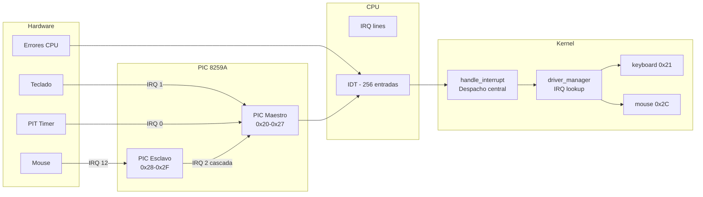
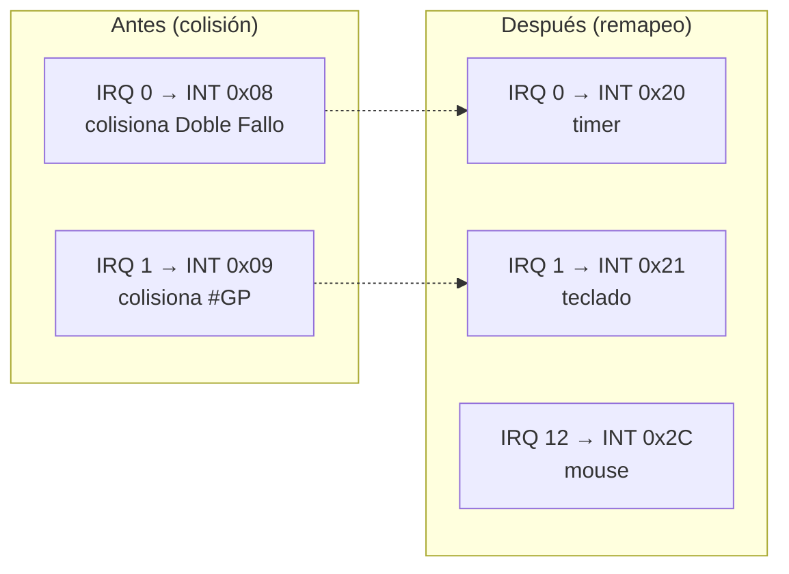
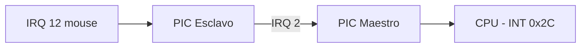
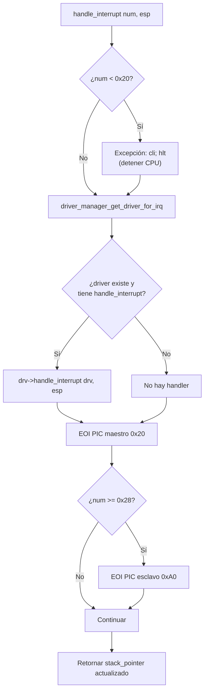
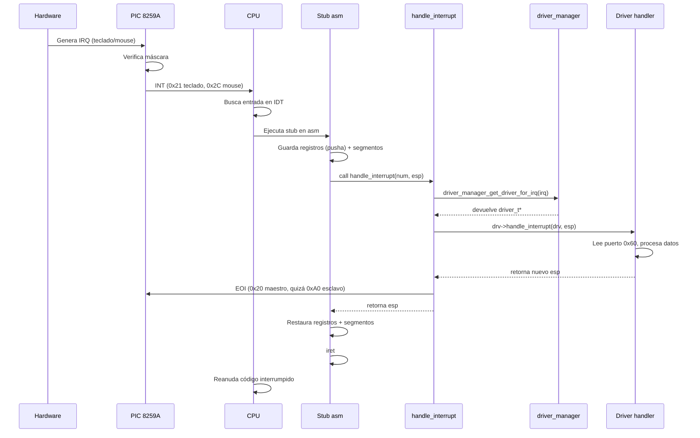

# Sistema de interrupciones — IDT / PIC 8259A (`include/kernel/interrupts.h` / `src/kernel/interrupts.c` / `asm/interruptstubs.s`)

## Qué es el sistema de interrupciones

Las **interrupciones** son mecanismos que permiten al CPU responder a eventos (teclado, temporizador, errores) deteniendo el código actual, ejecutando un **manejador** (handler) y resumiendo donde quedó. En modo protegido x86, el CPU usa la **IDT (Interrupt Descriptor Table)** para localizar los handlers.

## Componentes del sistema



## Dos tipos de interrupción

| Tipo | Vector | Origen | Ejemplo |
|------|--------|--------|---------|
| **Excepción** | `0x00 - 0x1F` | CPU (errores internos) | División por cero (0x00), Page Fault (0x0E) |
| **IRQ** (Hardware) | `0x20 - 0x2F` | Dispositivos externos | Teclado (IRQ 1), Mouse (IRQ 12), Timer (IRQ 0) |

## PIC 8259A — Controlador de interrupciones programable

El **PIC 8259A** es un chip (o emulación en hardware virtual) que gestiona las interrupciones de hardware. DemOS usa **dos PICs** conectados en cascada:

```
IRQ 0-7   → PIC Maestro (0x20-0x27)
IRQ 8-15  → PIC Esclavo  (0x28-0x2F)
              │
              └─ Conectado al IRQ 2 del PIC Maestro
```

### Puertos del PIC

| Puerto | Nombre | Propósito |
|--------|--------|-----------|
| `0x20` | PIC Maestro CMD | Enviar comandos de inicialización y EOI |
| `0x21` | PIC Maestro Data | Enmascarar IRQs y enviar ICW |
| `0xA0` | PIC Esclavo CMD | Enviar comandos al esclavo |
| `0xA1` | PIC Esclavo Data | Enmascarar IRQs del esclavo |

### Remapeo de IRQs

El PIC por defecto envía IRQs 0-7 como interrupciones `0x08-0x0F`, que **colisionan con las excepciones del CPU**. Por eso DemOS las remapea a `0x20-0x27`:



### Secuencia de inicialización ICW

DemOS envía las 4 palabras de inicialización (ICW1-ICW4) a ambos PICs:

```c
// ICW1: Inicialización, esperar ICW4
outb(0x20, 0x11);   outb(0xA0, 0x11);

// ICW2: Vector base (IRQ 0 → INT 0x20, IRQ 8 → INT 0x28)
outb(0x21, 0x20);   outb(0xA1, 0x28);

// ICW3: Conexiones (Maestro: IRQ 2 → esclavo, Esclavo: IRQ 2)
outb(0x21, 0x04);   outb(0xA1, 0x02);

// ICW4: Modo 8086
outb(0x21, 0x01);   outb(0xA1, 0x01);
```

### Enmascaramiento de IRQs

Después de ICW, se envía una máscara que decide qué IRQs están habilitadas:

```c
outb(0x21, 0xF8);   // Maestro: IRQ 0, 1 y 2 habilitadas
outb(0xA1, 0xEF);   // Esclavo: solo IRQ 12 (mouse) habilitada
```

```
Máscara maestro: 0xF8 = 11111000
                        │││││││└── IRQ 0 habilitada (Timer)
                        ││││││└─── IRQ 1 habilitada (Teclado)
                        │││││└──── IRQ 2 habilitada (Cascada → esclavo)
                        ││││└───── IRQ 3 deshabilitada
                  ...       (el resto deshabilitado)

Máscara esclavo: 0xEF = 11101111
                         │││││││└── IRQ 8 deshabilitada
                         ...
                         │││└────── IRQ 12 habilitada (Mouse)
                  ...        (el resto deshabilitado)
```

> **Nota**: IRQ 2 debe estar habilitada en el PIC maestro porque el mouse (IRQ 12) está conectado al PIC esclavo a través de IRQ 2 (cascada). Sin esta habilitación, ninguna interrupción del esclavo llegaría al CPU.



## IDT — Tabla de Descriptores de Interrupción

La **IDT** es una tabla de **256 entradas**, una por cada posible interrupción. Cada entrada es un descriptor de 8 bytes que apunta al handler en ensamblador.

### Estructura de cada entrada

```c
typedef struct __attribute__((packed)) {
    uint16_t handler_address_low_bits;   // Bits 0-15 de la dirección del handler
    uint16_t gdt_code_segment_selector;  // Selector de segmento de código (0x10)
    uint8_t reserved;                    // Siempre 0
    uint8_t access;                      // Tipo de compuerta + privilegios
    uint16_t handler_address_high_bits;  // Bits 16-31 de la dirección del handler
} gate_descriptor;
```

### Campo `access`

| Bit | Nombre | Valor en DemOS | Significado |
|-----|--------|----------------|-------------|
| 7 | P (Present) | 1 | Descriptor válido |
| 6-5 | DPL | 00 | Nivel 0 (solo kernel) |
| 4-3 | Type | 1110 | Compuerta de interrupción (32 bits) |

Valor completo: `0x8E` = `10001110` (Present=1, DPL=0, Type=0xE)

### Configuración de entradas

DemOS configura 3 tipos de entradas en la IDT:

| Rango | Handler | Uso |
|-------|---------|-----|
| `0x00 - 0x1F` | `exception_handler_table` | Excepciones del CPU |
| `0x20` | `handle_interrupt_request0x00` | IRQ 0 (Timer) |
| `0x21` | `handle_interrupt_request0x01` | IRQ 1 (Teclado) |
| `0x2C` | `handle_interrupt_request0x0C` | IRQ 12 (Mouse) |
| Resto | `ignore_interrupt_request` | Sin handler (solo EOI) |

## asm/interruptstubs.s — Stubs en ensamblador

Los **interrupt stubs** son funciones en ensamblador que sirven de puente entre el CPU y el manejador en C. Son necesarias porque el CPU:

1. **No puede llamar a C directamente** desde una interrupción
2. **Necesita guardar el estado** del CPU antes de ejecutar C
3. **Necesita restaurar el estado** y ejecutar `IRET` al retornar

### Macro `handle_interrupt_exception_no_err`

```asm
.macro handle_interrupt_exception_no_err num
.global handle_interrupt_exception\num
handle_interrupt_exception\num:
    pushl $0              ; Push error code dummy (0)
    movl $\num, (interruptnumber)  ; Guardar número de interrupción
    jmp int_bottom        ; Saltar al handler común
.endm
```

Usada para excepciones que **no pushean un error code** (`0x00-0x07`, `0x09`, `0x0F-0x13`, etc.).

### Macro `handle_interrupt_exception_err`

```asm
.macro handle_interrupt_exception_err num
handle_interrupt_exception\num:
    movl $\num, (interruptnumber)  ; Guardar número
    jmp int_bottom                 ; Error code ya está en la pila
.endm
```

Usada para excepciones que **sí pushean un error code** (`0x08`, `0x0A-0x0E`, `0x11`).

### Macro `handle_interrupt_request`

```asm
.macro handle_interrupt_request num
handle_interrupt_request\num:
    pushl $0              ; Dummy error code
    movl $\num + IRO_BASE, (interruptnumber)  ; IRQ + 0x20 = número de interrupción
    jmp int_bottom
.endm
```

Usada para IRQs de hardware (0x20, 0x21). El `IRO_BASE` (`0x20`) desplaza las IRQs para que no colisionen con excepciones.

### Código común `int_bottom`

```asm
int_bottom:
    pusha                  ; Guardar todos los registros generales
    pushl %ds              ; Guardar segmentos de datos
    pushl %es
    pushl %fs
    pushl %gs

    push %esp              ; Push puntero a la pila (como argumento)
    movl (interruptnumber), %eax
    pushl %eax             ; Push número de interrupción
    call handle_interrupt  ; Llamar al manejador en C

    movl %eax, %esp        ; Restaurar pila (handle_interrupt retorna ESP)

    pop %gs                ; Restaurar segmentos
    pop %fs
    pop %es
    pop %ds
    popa                   ; Restaurar registros generales
    add $4, %esp           ; Limpiar error code dummy
    iret                   ; Retornar de interrupción
```

### Tabla de excepciones

```asm
.global exception_handler_table
exception_handler_table:
    .long handle_interrupt_exception0x00   ; #DE - Divide Error
    .long handle_interrupt_exception0x01   ; #DB - Debug
    .long handle_interrupt_exception0x02   ; #NMI
    .long handle_interrupt_exception0x03   ; #BP - Breakpoint
    ...
```

Esta tabla permite iterar y asignar los handlers de excepción a las entradas de la IDT.

### `ignore_interrupt_request` — Handler por defecto

```asm
ignore_interrupt_request:
    pushl %eax
    movb $0x20, %al
    outb %al, $0x20       ; Enviar EOI al PIC maestro
    outb %al, $0xA0       ; Enviar EOI al PIC esclavo
    popl %eax
    iret
```

Para interrupciones sin handler real, solo envía el **EOI (End of Interrupt)** a ambos PICs y retorna.

## src/kernel/interrupts.c — Manejador en C

### `init_interrupt_manager()` — Configuración de la IDT

```c
void init_interrupt_manager(global_descriptor_table *gdt)
{
    uint16_t code_segment = gdt_get_code_selector(gdt);  // 0x10
    const uint8_t IDT_INTERRUPT_GATE = 0xE;

    // Rellenar todas las entradas con ignore_interrupt_request
    for (uint16_t i = 0; i < 256; i++)
        set_interrupt_descriptor_table_entry(i, code_segment,
            &ignore_interrupt_request, 0, IDT_INTERRUPT_GATE);

    // Configurar excepciones 0x00-0x1F
    for (uint16_t i = 0; i < 0x20; i++)
        set_interrupt_descriptor_table_entry(i, code_segment,
            exception_handler_table[i], 0, IDT_INTERRUPT_GATE);

    // Configurar IRQ 0 (Timer), IRQ 1 (Teclado) y IRQ 12 (Mouse)
    set_interrupt_descriptor_table_entry(0x20, code_segment,
        &handle_interrupt_request0x00, 0, IDT_INTERRUPT_GATE);
    set_interrupt_descriptor_table_entry(0x21, code_segment,
        &handle_interrupt_request0x01, 0, IDT_INTERRUPT_GATE);
    set_interrupt_descriptor_table_entry(0x2C, code_segment,
        &handle_interrupt_request0x0C, 0, IDT_INTERRUPT_GATE);

    // Inicializar PICs (remapeo + máscara)
    outb(0x20, 0x11);  outb(0xA0, 0x11);
    outb(0x21, 0x20);  outb(0xA1, 0x28);
    outb(0x21, 0x04);  outb(0xA1, 0x02);
    outb(0x21, 0x01);  outb(0xA1, 0x01);
    outb(0x21, 0xF8);  outb(0xA1, 0xEF);

    // Cargar IDT
    idt_pointer idt;
    idt.size = (256 * sizeof(gate_descriptor)) - 1;
    idt.base = (uint32_t)interrupt_descriptor_table;
    asm volatile("lidt %0" : : "m"(idt));
}
```

### `handle_interrupt()` — Despacho central

A diferencia de versiones anteriores que hardcodeaban `keyboard_handler` y `mouse_handler`, el despacho ahora usa el **driver_manager**:

```c
uint32_t handle_interrupt(uint8_t interrupt_number, uint32_t stack_pointer)
{
    // Excepciones: detener CPU
    if (interrupt_number < 0x20) {
        asm volatile("cli; hlt");
    }

    // Buscar el driver registrado para este IRQ y despachar
    driver_t *drv = driver_manager_get_driver_for_irq(&global_driver_manager, interrupt_number);
    if (drv && drv->handle_interrupt) {
        stack_pointer = drv->handle_interrupt(drv, stack_pointer);
    }

    // Enviar EOI al PIC
    outb(0x20, 0x20);
    if (interrupt_number >= 0x28)
        outb(0xA0, 0x20);

    return stack_pointer;
}
```



### EOI — End of Interrupt

Después de atender una interrupción, se **debe** enviar un EOI al PIC. Sin esto, el PIC no envía más interrupciones.

```c
outb(0x20, 0x20);       // EOI al PIC maestro
if (interrupt_number >= 0x28)
    outb(0xA0, 0x20);   // EOI al PIC esclavo (IRQ 8-15)
```

## Flujo completo de una interrupción



## Tabla de excepciones x86

| Vector | Nombre | Error code | Descripción |
|--------|--------|-----------|-------------|
| 0x00 | #DE | No | Divide Error |
| 0x01 | #DB | No | Debug |
| 0x02 | #NMI | No | NMI (No Maskable Interrupt) |
| 0x03 | #BP | No | Breakpoint |
| 0x04 | #OF | No | Overflow |
| 0x05 | #BR | No | Bound Range Exceeded |
| 0x06 | #UD | No | Invalid Opcode |
| 0x07 | #NM | No | Device Not Available |
| 0x08 | #DF | **Sí** | Double Fault |
| 0x09 | #TS | No | Coprocessor Segment Overrun |
| 0x0A | #TS | **Sí** | Invalid TSS |
| 0x0B | #NP | **Sí** | Segment Not Present |
| 0x0C | #SS | **Sí** | Stack-Segment Fault |
| 0x0D | #GP | **Sí** | General Protection Fault |
| 0x0E | #PF | **Sí** | Page Fault |
| 0x10 | #MF | No | x87 FPU Floating-Point Error |
| 0x11 | #AC | **Sí** | Alignment Check |
| 0x12 | #MC | No | Machine Check |
| 0x13 | #XM | No | SIMD Floating-Point Exception |
