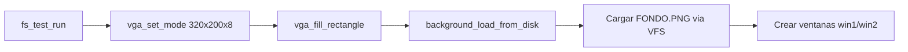
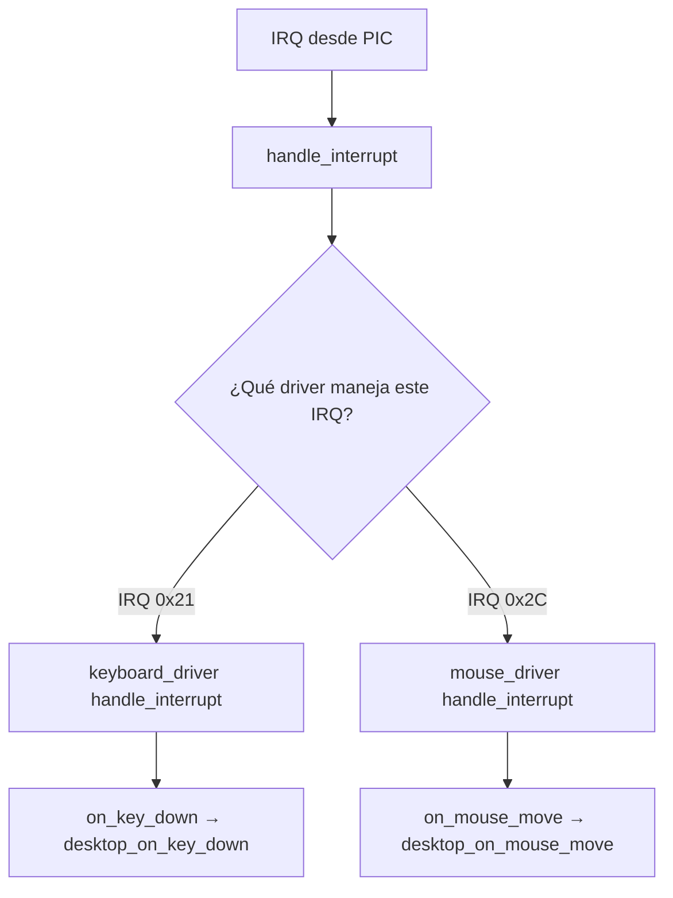

# Kernel principal (src/kernel/main.c)

## Propósito

`src/kernel/main.c` es el punto de entrada del kernel en C. Sirve como orquestador que inicializa todos los subsistemas: drivers, filesystem, modo gráfico y el entorno de ventanas. Utiliza un **driver manager** centralizado en lugar de acceder directamente a cada driver.

## Contenido completo

```c
/* main.c - Punto de entrada principal del kernel.
   Llamado desde el archivo de arranque en ensamblador (asm/loader.s).
   Inicializa el sistema, registra los drivers y lanza la pantalla de presentacion. */

#include "drivers/driver.h"
#include "drivers/keyboard.h"
#include "drivers/mouse.h"
#include "drivers/serial.h"
#include "drivers/vga.h"
#include "fs/fstest.h"
#include "fs/vfs.h"
#include "graphic_context.h"
#include "gui/desktop.h"
#include "gui/window.h"
#include "kernel/gdt.h"
#include "kernel/interrupts.h"
#include "kernel/pci.h"
#include "types.h"
#include "util/png.h"
#include "util/splash.h"
#include "util/util_lib.h"

/* Drivers estaticos - se registran en el administrador */
static keyboard_driver_t kb_driver;
static mouse_driver_t ms_driver;

static graphic_context_t gc;
static desktop_t desktop;
static window_t win1;
static window_t win2;

/* Pixels del fondo del escritorio (320x200, indices de la paleta VGA por
   defecto). Se compone al back buffer en cada frame por desktop_draw, por lo
   que no se sobrescribe. */
static uint8_t background_pixels[320 * 200];
static uint8_t vga_palette[256][3];

/* Lee /FONDO.PNG del disco (nombre FAT 8.3), lo decodifica con la herramienta
   PNG del kernel y lo deja listo como fondo persistente del escritorio. */
static void background_load_from_disk(void)
{
    static uint8_t file_data[PNG_FILE_MAX];
    int fd = vfs_open("/FONDO.PNG", 1);
    if (fd < 0) {
        return;
    }

    uint32_t total = 0;
    for (;;) {
        int n = vfs_read(fd, file_data + total, (uint32_t)(sizeof(file_data) - total));
        if (n <= 0) {
            break;
        }
        total += (uint32_t)n;
    }
    vfs_close(fd);
    if (total < 8) {
        return;
    }

    vga_read_palette(vga_palette);

    uint32_t w = 0;
    uint32_t h = 0;
    bool r = png_decode_indexed(file_data, total, vga_palette, background_pixels,
                               (uint32_t)sizeof(background_pixels), &w, &h);
    if (r != false) {
        return;
    }

    desktop_set_background(&desktop, background_pixels, w, h);
}

int kernel_main()
{
    static global_descriptor_table gdt;

    serial_init(COM1_BASE_ADDRESS);
    init_gdt(&gdt);
    init_interrupt_manager(&gdt);

    serial_write_string(COM1_BASE_ADDRESS, "[KERNEL] Initializing hardware, Stage 1\n", 39);

    driver_manager_init(&global_driver_manager);

    graphic_context_init(&gc);
    desktop_init(&desktop, &gc);

    keyboard_driver_init(&kb_driver, desktop_on_key_down, &desktop);
    kb_driver.on_key_up = desktop_on_key_up;
    driver_manager_add(&global_driver_manager, &kb_driver.base);

    mouse_driver_init(&ms_driver, desktop_on_mouse_move, &desktop);
    ms_driver.on_mouse_button = desktop_on_mouse_button;
    driver_manager_add(&global_driver_manager, &ms_driver.base);

    select_drivers(&global_driver_manager);

    serial_write_string(COM1_BASE_ADDRESS, "[KERNEL] Initializing hardware, Stage 2\n", 39);

    driver_manager_activate_all(&global_driver_manager);

    fs_test_run();

    vga_set_mode(320, 200, 8);
    vga_fill_rectangle(0, 0, 320, 200, 0x09);
    background_load_from_disk();

    window_init(&win1, &desktop.base.base, 10, 10, 20, 20, 0x04, NULL);
    composite_widget_add_child(&desktop.base, &win1.base.base);
    window_init(&win2, &desktop.base.base, 40, 15, 30, 30, 0x02, NULL);
    composite_widget_add_child(&desktop.base, &win2.base.base);

    serial_write_string(COM1_BASE_ADDRESS, "[KERNEL] Initializing hardware, Stage 3\n", 39);

    asm volatile("sti");

    for (;;) {
        desktop_draw(&desktop, &gc);
        graphic_context_flush(&gc);
    }

    return 0;
}
```

## Explicación por fases

### Fase 1: Subsistemas base


| Llamada | Función | Propósito |
|---------|---------|-----------|
| `serial_init(COM1_BASE_ADDRESS)` | UART 16550 | Puerto serie para depuración |
| `init_gdt(&gdt)` | `gdt.c` | Configura 4 descriptores de segmento |
| `init_interrupt_manager(&gdt)` | `interrupts.c` | IDT (256 entradas) + remapeo PIC |
| `driver_manager_init()` | `driver.c` | Inicializa la tabla de drivers |

### Fase 2: Entorno gráfico y drivers


A diferencia de versiones anteriores, el teclado y el mouse ahora se registran en el **driver manager** y sus eventos se despachan al **escritorio** (`desktop_on_key_down`, `desktop_on_mouse_move`, etc.), no directamente a la pantalla VGA.

### Fase 3: Filesystem y modo gráfico



- `fs_test_run()` monta el disco FAT32 vía ATA y valida la lectura de archivos.
- `vga_set_mode(320, 200, 8)` cambia del modo texto al **modo gráfico Mode 13h**.
- `background_load_from_disk()` decodifica `FONDO.PNG` del disco y lo usa como fondo del escritorio.
- Se crean **dos ventanas de ejemplo** arrastrables.

### Fase 4: Bucle principal

```c
for (;;) {
    desktop_draw(&desktop, &gc);
    graphic_context_flush(&gc);
}
```

1. `desktop_draw()` dibuja fondo + ventanas + cursor en el **back buffer**.
2. `graphic_context_flush()` copia el back buffer al framebuffer VGA, esperando el **retrace vertical** (vsync) para evitar tearing.

## Modularidad

El kernel principal se mantiene relativamente minimalista. Toda la lógica compleja vive en módulos separados:

| Módulo | Responsabilidad |
|--------|-----------------|
| `src/kernel/gdt.c` | Tabla de Descriptores Globales (segmentos de memoria) |
| `src/kernel/interrupts.c` | IDT, PIC 8259A, despacho de interrupciones |
| `src/kernel/pci.c` | Enumeración PCI, detección de dispositivos y drivers |
| `src/drivers/driver.c` | Administrador centralizado de drivers |
| `src/drivers/keyboard.c` | Driver de teclado PS/2 con callbacks |
| `src/drivers/mouse.c` | Driver de mouse PS/2 con callbacks |
| `src/drivers/serial.c` | Puerto serie UART 16550 (depuración) |
| `src/drivers/ata.c` | Driver de disco ATA/IDE (PIO, LBA28) |
| `src/fs/vfs.c` | Sistema de archivos virtual |
| `src/fs/fat32.c` | Driver de sistema de archivos FAT32 |
| `src/gui/desktop.c` | Escritorio gráfico (raíz de widgets) |
| `src/gui/window.c` | Ventanas arrastrables con barra de título |
| `src/gui/widget.c` | Sistema base de widgets |
| `src/gui/graphic_context.c` | Double buffer + flush con vsync |
| `src/util/png.c` | Decodificador PNG completo |
| `src/util/big_text.c` | Letras grandes 5x5, dibujo de cajas |
| `src/util/splash.c` | Animación de bienvenida |
| `src/drivers/timer.c` | Espera activa (delay) |
| `src/drivers/vga.c` | Modo gráfico VGA |
| `src/drivers/vga_legacy.c` | Modo texto VGA |

### Notas sobre el driver manager



`handle_interrupt()` en `interrupts.c` usa `driver_manager_get_driver_for_irq()` para encontrar y despachar al driver correcto, sin hardcodear cada IRQ en el kernel.
