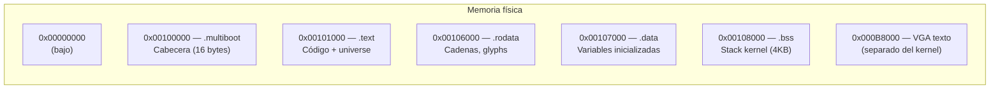

# Script de enlace (link.ld)

## Qué es un linker script

Un **linker script** le indica al enlazador (`ld`) cómo organizar las diferentes secciones del kernel en la memoria. Es esencial en desarrollo de SO porque no usamos el layout estándar de un ejecutable normal.

## Contenido completo

```ld
ENTRY(loader)

SECTIONS {
    . = 0x00100000;

    .multiboot ALIGN(4) :
    {
        *(.multiboot)
    }

    .text ALIGN(0x1000) :
    {
        *(.text)
    }

    .rodata ALIGN(0x1000) :
    {
        *(.rodata)
    }

    .data ALIGN(0x1000) :
    {
        *(.data)
    }

    .bss ALIGN(0x1000) :
    {
        *(COMMON)
        *(.bss)
    }
}
```

## Explicación sección por sección

### `ENTRY(loader)`

Define el **punto de entrada** del kernel: la etiqueta `loader` definida en `asm/loader.s`. Sin esto, el enlazador usaría `_start` por defecto.

### `. = 0x00100000;`

Establece la **dirección base** del kernel en `0x00100000` (1 MB). Esta es la dirección convencional donde GRUB carga los kernels Multiboot.

### `.multiboot ALIGN(4)`

Contiene la **cabecera Multiboot** (definida en `asm/loader.s`). Debe estar alineada a 4 bytes y aparecer en los primeros 8 KB del kernel para que GRUB la reconozca.

### `.text ALIGN(0x1000)`

Contiene el **código ejecutable** del kernel (instrucciones de máquina). Alineado a 4 KB (tamaño de página).

### `.rodata`

Contiene datos de **solo lectura** (como cadenas de texto y los glyphs de big_text).

### `.data`

Contiene **variables globales inicializadas**.

### `.bss`

Contiene **variables globales no inicializadas** o inicializadas a cero, como la pila del kernel (`kernel_stack`). Se alinea a 4 KB.

> **Nota**: En el BSS, `*(COMMON)` recoge los símbolos comunes (generados por compiladores viejos) y `*(.bss)` recoge las variables sin inicializar.

## Mapa de memoria resultante



| Dirección | Sección | Contenido |
|-----------|---------|-----------|
| `0x00100000` | `.multiboot` | Cabecera Multiboot (16 bytes) |
| `0x00101000` | `.text` | Código del loader + kernel |
| `0x00104000` | `.rodata` | Cadenas constantes, glyphs |
| `0x00105000` | `.data` | Variables inicializadas |
| `0x00106000` | `.bss` | Pila del kernel (4 KB) |
