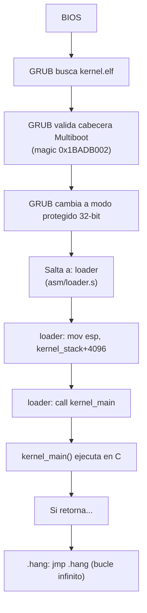

# Loader en ensamblador (asm/loader.s)

## Propósito

El archivo `asm/loader.s` es el **verdadero punto de entrada** del kernel. Está escrito en ensamblador x86 (NASM) porque necesitamos control directo sobre:

1. La **cabecera Multiboot** que GRUB requiere para identificar el kernel.
2. La configuración de la **pila (stack)** antes de llamar a código C.

## Contenido completo

```nasm
BITS 32

global loader
extern kernel_main

MAGIC_NUMBER equ 0x1BADB002
FLAGS        equ 0x0
CHECKSUM     equ -(MAGIC_NUMBER + FLAGS)
KERNEL_STACK_SIZE equ 4096

section .multiboot
align 4
    dd MAGIC_NUMBER
    dd FLAGS
    dd CHECKSUM

section .text
loader:
    mov esp, kernel_stack + KERNEL_STACK_SIZE
    call kernel_main
.hang:
    jmp .hang

section .bss
align 4
kernel_stack:
    resb KERNEL_STACK_SIZE

section .note.GNU-stack noalloc
```

## Explicación detallada

### Directivas iniciales

| Directiva | Significado |
|-----------|-------------|
| `BITS 32` | El CPU está en modo protegido de 32 bits (GRUB ya lo configuró así) |
| `global loader` | Hace visible la etiqueta `loader` para el enlazador (`ld`) |
| `extern kernel_main` | Declara que `kernel_main` está definida en otro archivo (C) |

### Cabecera Multiboot

```nasm
MAGIC_NUMBER equ 0x1BADB002
FLAGS        equ 0x0
CHECKSUM     equ -(MAGIC_NUMBER + FLAGS)

section .multiboot
align 4
    dd MAGIC_NUMBER
    dd FLAGS
    dd CHECKSUM
```

GRUB busca esta cabecera en los primeros 8 KB del kernel. Debe estar alineada a 4 bytes.

| Campo | Valor | Significado |
|-------|-------|-------------|
| `MAGIC_NUMBER` | `0x1BADB002` | Número mágico que identifica un kernel Multiboot |
| `FLAGS` | `0x0` | Sin requisitos especiales (no necesita información de memoria ni modo gráfico) |
| `CHECKSUM` | `-(0x1BADB002 + 0x0)` | La suma de los 3 campos debe ser 0 para que GRUB valide la cabecera |

### Sección `.text` — Código

```nasm
loader:
    mov esp, kernel_stack + KERNEL_STACK_SIZE
    call kernel_main
.hang:
    jmp .hang
```

1. **`mov esp, kernel_stack + KERNEL_STACK_SIZE`**: Configura el puntero de pila (`ESP`) apuntando al **final** del área reservada para la pila (la pila crece hacia abajo en x86).
2. **`call kernel_main`**: Llama a la función C `kernel_main()`.
3. **`.hang: jmp .hang`**: Bucle infinito por si `kernel_main` retorna (en un SO real, aquí se apagaría el sistema).

### Sección `.bss` — Pila del kernel

```nasm
kernel_stack:
    resb KERNEL_STACK_SIZE
```

- `resb` (Reserve Byte) reserva 4096 bytes (4 KB) para la pila.
- Estos bytes no ocupan espacio en la ISO; el cargador los asigna a cero en memoria.

### Sección `.note.GNU-stack`

```nasm
section .note.GNU-stack noalloc
```

Directiva para el enlazador GNU que indica que la pila **no** debe ser ejecutable (seguridad).

## Diagrama de arranque



## Sintaxis NASM vs AT&T

DemOS usa **NASM** (sintaxis Intel), que es más legible que la sintaxis AT&T de GAS:

| Operación | NASM (Intel) | AT&T (GAS) |
|-----------|--------------|------------|
| Mover | `mov esp, stack` | `movl $stack, %esp` |
| Llamar | `call kernel_main` | `call kernel_main` |
| Saltar | `jmp .hang` | `jmp .hang` |
