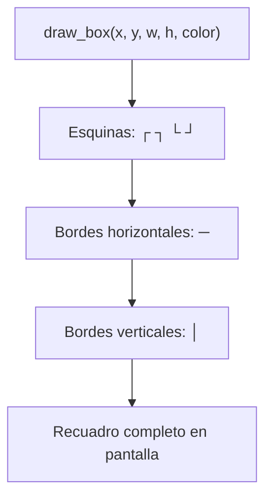

# Texto grande (`include/util/big_text.h` / `src/util/big_text.c`)

## Qué es

`big_text.c` define el renderizado de **caracteres grandes (5x5)** y un utilitario para **dibujar recuadros** con caracteres de línea del juego de caracteres VGA. Se usa en la animación de arranque (splash).

## Glifos 5x5

Cada glifo es una matriz de 5x5 donde `1` = encendido y `0` = apagado:

```c
#define CHAR_W 5
#define CHAR_H 5

extern const uint8_t glyph_D[CHAR_H][CHAR_W];
extern const uint8_t glyph_e[CHAR_H][CHAR_W];
extern const uint8_t glyph_m[CHAR_H][CHAR_W];
extern const uint8_t glyph_O[CHAR_H][CHAR_W];
extern const uint8_t glyph_S[CHAR_H][CHAR_W];
```

Los glifos disponibles componen la palabra **"DemOS"** (D, e, m, O, S).

## Funciones

### `draw_big_char` — dibujar un carácter grande

```c
void draw_big_char(const uint8_t (*glyph)[CHAR_W], uint16_t r0, uint16_t c0, uint8_t color);
```

| Parámetro | Descripción |
|-----------|-------------|
| `glyph` | Matriz 5x5 que define la forma del carácter |
| `r0`, `c0` | Posición en pantalla (fila, columna) de la esquina superior izquierda |
| `color` | Color del primer plano |

```mermaid
flowchart TD
    A["draw_big_char(glyph, r0, c0, color)"] --> B[Recorrer filas 0..4]
    B --> C[Recorrer columnas 0..4]
    C --> D{glyph[r][c] == 1 ?}
    D -->|Sí| E[Encender píxel en r0+r, c0+c]
    D -->|No| F[Seguir]
    E --> F
    F --> C
    C --> B
```

### `draw_box` — dibujar un recuadro

```c
void draw_box(uint16_t x, uint16_t y, uint16_t w, uint16_t h, uint8_t color);
```

| Parámetro | Descripción |
|-----------|-------------|
| `x`, `y` | Coordenada superior izquierda (columna, fila) |
| `w`, `h` | Ancho y alto del recuadro |
| `color` | Color del borde |

Se dibuja usando los **caracteres de línea** del juego de caracteres VGA (├ ┤ ─ │ ┌ ┐ └ ┘ etc.) en modo texto.



## Dependencias

| Módulo | Uso |
|--------|-----|
| `types.h` | Tipos enteros |
| `drivers/vga_legacy.h` | Escritura en modo texto y caracteres de línea |
