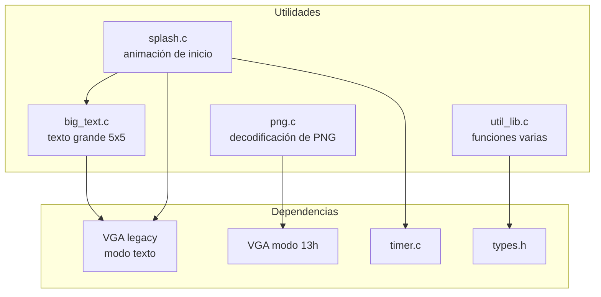

# Utilidades

Herramientas auxiliares del kernel: decodificación de imágenes, renderizado de texto y animaciones.

## Módulos

## En esta sección

- [Decodificador PNG](./png/) — lectura de imágenes para la GUI
- [Texto grande](./big-text/) — glifos 5x5 y recuadros
- [Splash](./splash/) — animación de arranque
- [Utilidades varias](./util-lib/) — funciones de ayuda
- [Tipos y E/S](./types-asm/) — tipos enteros y puertos de E/S
