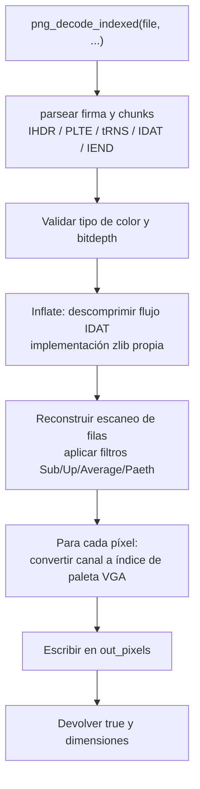
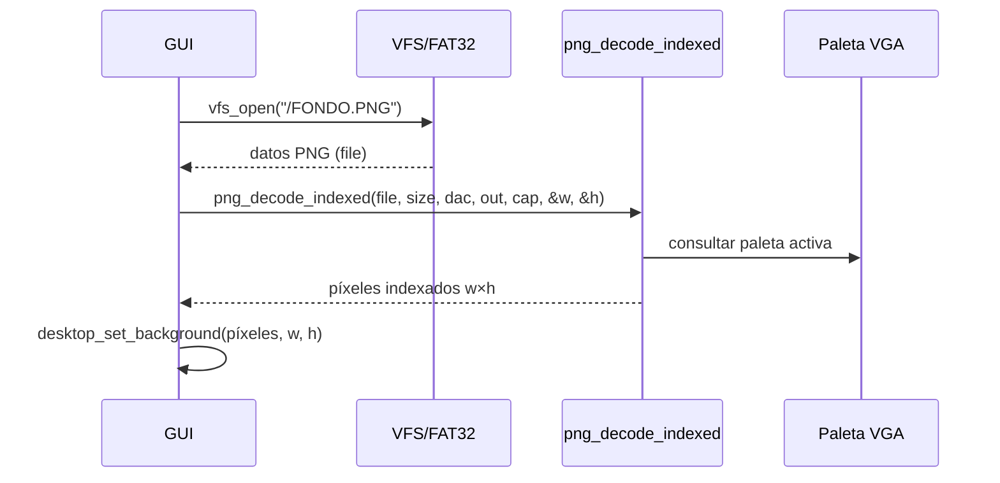

# Decodificador PNG (`include/util/png.h` / `src/util/png.c`)

## Qué es

`png_decode_indexed()` decodifica una imagen **PNG** y emite un **índice de paleta** por píxel, mapeando cada canal de color a la paleta VGA activa. Es la herramienta que carga el fondo del escritorio (`/FONDO.PNG`).

## Por qué un decodificador propio

DemOS funciona sin libc y sin bibliotecas de terceros. Para mostrar una imagen de fondo necesita un decodificador PNG desde cero, incluyendo:

- **inflate/zlib propios** (descompresión Deflate del flujo IDAT).
- Los **filtros de PNG** (None, Sub, Up, Average, Paeth).
- Conversión de cada píxel (RGB/RGBA/grises/paleta indexada con tRNS) a un índice de la paleta VGA.

## Funcionamiento

```c
bool png_decode_indexed(const uint8_t *file, uint32_t file_size, const uint8_t (*dac)[3],
                        uint8_t *out_pixels, uint32_t out_capacity, uint32_t *out_w,
                        uint32_t *out_h);
```

| Parámetro | Descripción |
|-----------|-------------|
| `file` | Contenido completo del archivo PNG |
| `file_size` | Tamaño de `file` |
| `dac` | Paleta VGA activa (256 entradas de 6 bits `[r][g][b]` en 0..63) |
| `out_pixels` | Buffer de salida (`w*h` índices de 8 bits) |
| `out_capacity` | Capacidad de `out_pixels` en bytes |
| `out_w`, `out_h` | Dimensiones decodificadas |
| **Return** | `true` en éxito, `false` en error |

## Restricciones

El decodificador está optimizado para el caso de uso del kernel:

- **No** usa entrelazado **Adam7**.
- **No** soporta **bitdepth 16** para el color tipo 3 (paleta).
- Límites de tamaño (para 320×200):

| Constante | Valor | Descripción |
|-----------|-------|-------------|
| `PNG_FILE_MAX` | 40000 | Tamaño máximo del archivo PNG en disco |
| `PNG_RAW_MAX` | 256200 | Salida inflada máxima (320×200 RGBA + filtros) |
| `PNG_PIXELS_MAX` | 64000 | `320 * 200` píxeles |

## Flujo de decodificación



### Paso a paso

1. **Parseo de chunks**: se leen los chunks principales `IHDR` (dimensiones, bitdepth, tipo de color), `PLTE` (paleta), `tRNS` (transparencia), `IDAT` (datos comprimidos) e `IEND` (fin).
2. **inflate/zlib**: se descomprime el flujo IDAT (compresión Deflate con cabecera zlib).
3. **Filtros**: cada escaneo de fila se reconstruye aplicando el filtro correspondiente (None/Sub/Up/Average/Paeth).
4. **Mapeo a paleta**: cada píxel de color directo o indexado se convierte al índice más cercano de la paleta VGA (`dac`, 256 entradas).

## Uso: cargar el fondo del escritorio



## Dependencias

| Módulo | Uso |
|--------|-----|
| `types.h` | Tipos enteros de ancho fijo |
| `fs/vfs.h` | (en el caller) lectura del archivo desde el disco |
| `drivers/vga.h` | Paleta VGA activa (`dac`) |
