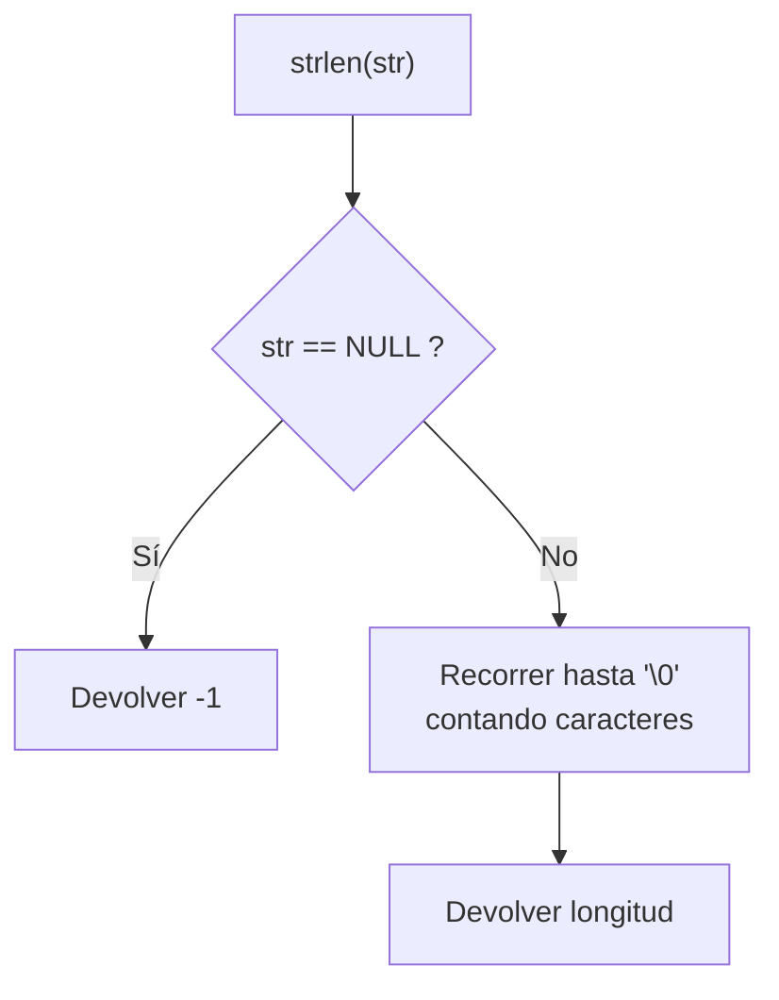

# Utilidades varias (`include/util/util_lib.h` / `src/util/util_lib.c`)

## Qué es

`util_lib.c` agrupa funciones de utilidad para el kernel que no requieren libc.

## `strlen`

```c
int64_t strlen(const char *str);
```

Calcula la longitud de una cadena terminada en nulo.

| Parámetro | Descripción |
|-----------|-------------|
| `str` | Puntero a la cadena |
| **Return** | Longitud en caracteres, o `-1` si `str` es `NULL` |



Se usa en varios módulos (VFS, serial, etc.) para evitar depender de la libc.

## Dependencias

| Módulo | Uso |
|--------|-----|
| `types.h` | Tipos enteros (int64_t) |
